# 🍘 仙貝工具


## Volatility

下載連結：

Volatility 2 :  https://github.com/volatilityfoundation/volatility

Volatility 3 :  https://github.com/volatilityfoundation/volatility3

經典的記憶體分析工具，利用指令可以分析 memory dump 中的關鍵訊息，像是進程、網路連線、檔案......等等。

基本的操作這邊推薦可以直接上網查有人整理好的指令doc


而Volatility分為2與3版，差別就是一個是要使用 python2 執行，另一個是用 python3 執行，並且現在Volatility 2 已經沒有在維護了，但是一些 Plugin 的完整度在目前為止還是比 Volatility 3 還要高並且豐富，所以有些人還是會比較會偏向使用 Volatility 2 ，今天分享會主要使用 Volatility 3


## Ida 

下載連結：https://hex-rays.com/ida-pro

經典反編譯工具， 可以將執行檔反編譯成人可以看懂的程式碼


# Cyberchef 

網站連結：https://gchq.github.io/CyberChef/

非常好用的解密網站，支援多個加解密功能

***


# 題目大綱


這題的題意大致是，他發現了他的檔案被加密了，請恢復他，因此主要的目標是會需要找到怪怪的加密程式以及被加密的檔案，並分析他的加密程式是怎麼加密的並還原他。


# 調查開始


起手式先看一下他的作業系統以及他的版本是多少

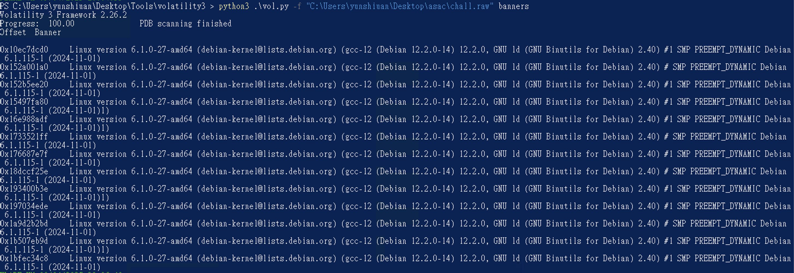

得知說這個 memory dump 的作業系統為 Debian，而他 Linux 核心版本是 6.1.0-27，並且他是2024-11-01出現的，試試看pslist有沒有辦法出現東西，但因為官方給的Sysbol Table太少，因此高機率會出現 Symbol Table 缺失錯誤

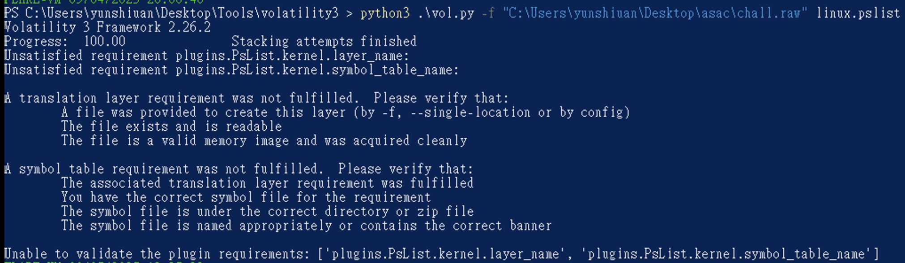

因此可以試試看前一天提到的 https://github.com/Abyss-W4tcher/volatility3-symbols 有人已經幫忙整理的 Symbol Table 找找看，這邊剛好他有。

因此把對應版本的 Symbol Table 下載下來後放在V olatility 3 資料夾中的 volatility3\symbols\linux 路徑，再次用 pslist 看一下會不會成功。發現確實可以正常分析了

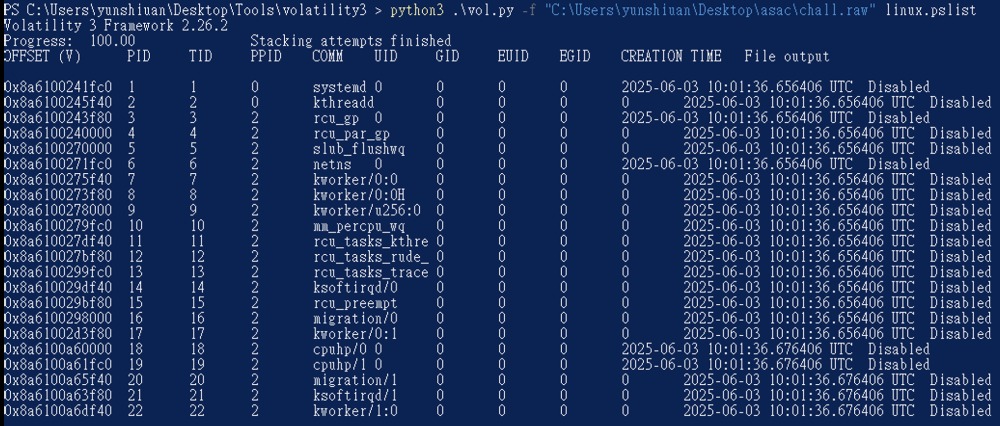

接下來下pstree 看一下有什麼值得看並且可疑的進程

```
PS C:\Users\yunshiuan\Desktop\Tools\volatility3 > python3 .\vol.py -f "C:\Users\yunshiuan\Desktop\asac\chall.raw" linux.pstree
Volatility 3 Framework 2.26.2
Progress:  100.00               Stacking attempts finished
OFFSET (V)      PID     TID     PPID    COMM

0x8a6100241fc0  1       1       0       systemd
* 0x8a611367bf80        356     356     1       systemd-journal
* 0x8a61015d5f40        388     388     1       systemd-udevd
* 0x8a610b808000        440     440     1       systemd-timesyn
* 0x8a6107958000        630     630     1       accounts-daemon
* 0x8a6107959fc0        631     631     1       anacron
* 0x8a610795bf80        632     632     1       avahi-daemon
** 0x8a610b823f80       646     646     632     avahi-daemon
* 0x8a61015d0000        633     633     1       cron
* 0x8a61159b5f40        634     634     1       dbus-daemon
* 0x8a61159b1fc0        636     636     1       low-memory-moni
* 0x8a61159b3f80        637     637     1       polkitd
* 0x8a610794df40        638     638     1       power-profiles-
* 0x8a6107948000        639     639     1       switcheroo-cont
* 0x8a6107949fc0        640     640     1       systemd-logind
* 0x8a610794bf80        641     641     1       udisksd
* 0x8a6107965f40        652     652     1       NetworkManager
* 0x8a6106740000        657     657     1       wpa_supplicant
* 0x8a6112083f80        674     674     1       ModemManager
* 0x8a61120a8000        693     693     1       cupsd
* 0x8a61120a9fc0        707     707     1       gdm3
** 0x8a6110c3bf80       1193    1193    707     gdm-session-wor
*** 0x8a610b80df40      1273    1273    1193    gdm-wayland-ses
**** 0x8a6108263f80     1283    1283    1273    gnome-session-b
* 0x8a6103590000        724     724     1       cups-browsed
* 0x8a61035a3f80        773     773     1       rtkit-daemon
* 0x8a6108a4df40        893     893     1       upowerd
* 0x8a610abfbf80        923     923     1       geoclue
* 0x8a610abf8000        930     930     1       packagekitd
* 0x8a6112e08000        938     938     1       colord
* 0x8a610a445f40        1205    1205    1       systemd
** 0x8a6108a4bf80       1208    1208    1205    (sd-pam)
** 0x8a61120a0000       1223    1223    1205    pipewire
** 0x8a6107658000       1228    1228    1205    wireplumber
** 0x8a6107453f80       1232    1232    1205    pipewire-pulse
** 0x8a610a438000       1234    1234    1205    dbus-daemon
** 0x8a610a43df40       1235    1235    1205    gnome-keyring-d
** 0x8a610a439fc0       1244    1244    1205    gvfsd
*** 0x8a6112e09fc0      2041    2041    1244    gvfsd-trash
** 0x8a6109c2df40       1258    1258    1205    gvfsd-fuse
** 0x8a6104c80000       1324    1324    1205    tracker-miner-f
** 0x8a6104c7df40       1332    1332    1205    gcr-ssh-agent
** 0x8a6104c78000       1333    1333    1205    gnome-session-c
** 0x8a6104c79fc0       1334    1334    1205    ssh-agent
** 0x8a6108265f40       1342    1342    1205    gnome-session-b
*** 0x8a61027c1fc0      1360    1360    1342    at-spi-bus-laun
**** 0x8a61027d1fc0     1373    1373    1360    dbus-daemon
*** 0x8a6108105f40      1540    1540    1342    evolution-alarm
*** 0x8a6112c89fc0      1569    1569    1342    gsd-disk-utilit
*** 0x8a6109a73f80      1574    1574    1342    gnome-software
** 0x8a61027c5f40       1361    1361    1205    gvfs-udisks2-vo
** 0x8a61027d0000       1365    1365    1205    gnome-shell
** 0x8a61027d3f80       1376    1376    1205    gvfs-gphoto2-vo
** 0x8a61027c0000       1385    1385    1205    gvfs-goa-volume
** 0x8a6107d43f80       1395    1395    1205    goa-daemon
** 0x8a6107b70000       1408    1408    1205    goa-identity-se
** 0x8a6107b75f40       1417    1417    1205    gvfs-mtp-volume
** 0x8a6107b10000       1422    1422    1205    gvfs-afc-volume
** 0x8a6107ba1fc0       1460    1460    1205    xdg-permission-
** 0x8a6107ba3f80       1463    1463    1205    gnome-shell-cal
** 0x8a610815df40       1475    1475    1205    evolution-sourc
** 0x8a6108161fc0       1486    1486    1205    gjs
** 0x8a61080e9fc0       1488    1488    1205    at-spi2-registr
** 0x8a6108163f80       1498    1498    1205    sh
*** 0x8a6112c8bf80      1568    1568    1498    ibus-daemon
**** 0x8a615b9e1fc0     1689    1689    1568    ibus-dconf
**** 0x8a615b9e0000     1690    1690    1568    ibus-extension-
**** 0x8a61111a0000     1759    1759    1568    ibus-engine-sim
** 0x8a6108171fc0       1501    1501    1205    gsd-a11y-settin
** 0x8a6108175f40       1502    1502    1205    gsd-color
** 0x8a6108173f80       1503    1503    1205    gsd-datetime
** 0x8a6108170000       1505    1505    1205    gsd-housekeepin
** 0x8a6108180000       1508    1508    1205    gsd-keyboard
** 0x8a6108181fc0       1512    1512    1205    gsd-media-keys
** 0x8a6108185f40       1518    1518    1205    gsd-power
** 0x8a6108183f80       1519    1519    1205    gsd-print-notif
** 0x8a61080f1fc0       1526    1526    1205    gsd-rfkill
** 0x8a61080f3f80       1527    1527    1205    gsd-screensaver
** 0x8a611118df40       1536    1536    1205    gsd-sharing
** 0x8a611118bf80       1537    1537    1205    gsd-smartcard
** 0x8a6111188000       1538    1538    1205    gsd-sound
** 0x8a6111189fc0       1539    1539    1205    gsd-usb-protect
** 0x8a61111a1fc0       1541    1541    1205    gsd-wacom
** 0x8a6112c95f40       1570    1570    1205    evolution-calen
** 0x8a615b86df40       1633    1633    1205    gjs
** 0x8a615b9cbf80       1684    1684    1205    evolution-addre
** 0x8a615b9cdf40       1700    1700    1205    ibus-portal
** 0x8a615b9f5f40       1712    1712    1205    gsd-printer
** 0x8a6112088000       1745    1745    1205    xdg-desktop-por
** 0x8a6109a90000       1758    1758    1205    xdg-document-po
*** 0x8a61661a5f40      1778    1778    1758    fusermount3
** 0x8a615bbf8000       1789    1789    1205    xdg-desktop-por
** 0x8a610745df40       1830    1830    1205    xdg-desktop-por
** 0x8a6108859fc0       2015    2015    1205    gnome-calendar
** 0x8a61035a1fc0       2017    2017    1205    gnome-control-c
** 0x8a61035a0000       2021    2021    1205    gnome-terminal-
*** 0x8a610b801fc0      2255    2255    2021    bash
**** 0x8a6107ba0000     2258    2258    2255    su
***** 0x8a6112c9df40    2259    2259    2258    bash
****** 0x8a6110c3df40   2272    2272    2259    avml
** 0x8a6103431fc0       2102    2102    1205    dconf-service
** 0x8a610b813f80       2261    2261    1205    su
** 0x8a6108868000       2279    2279    1205    gvfsd-metadata
* 0x8a6108f9bf80        1841    1841    1       fwupd
```

其中有趣的是在 102 行 他開了bash 後執行了 su ，之後底下又開了 bash 之後是 avml ，如果是bash的話有一個很不錯用的linux.bash Plugin 可以使用，它可以去看之前使用者在bash中輸入了什麼指令。

```
python3 .\vol.py -f "C:\Users\yunshiuan\Desktop\asac\chall.raw" linux.bash
```

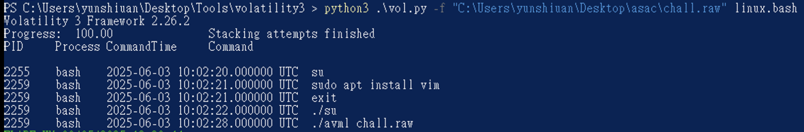

看到超可疑的 su 了，因為一般下 su 不會使用`./` 在現在位置執行，因此可重點去看這個 su 在幹嘛。

首先先看這個 su 到底在哪裡

```powershell
python3 .\vol.py -f "C:\Users\yunshiuan\Desktop\asac\chall.raw" linux.pagecache.Files > files.txt
```

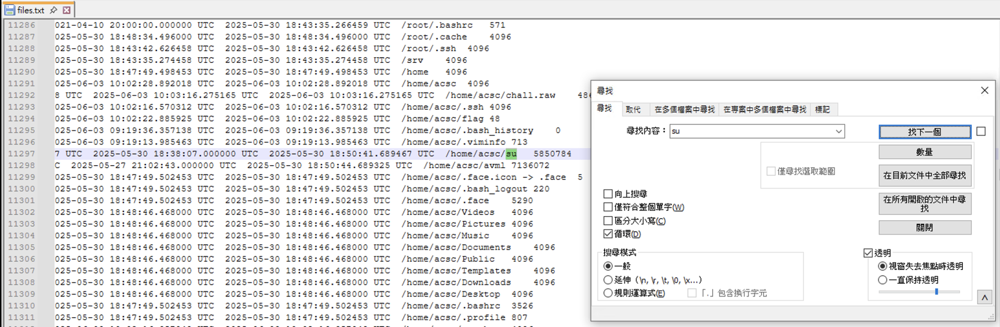

ok 找到了 發現他被放在`/home/acsc/su` ，接下來知道他在哪之後就可以把它 Dump 出來

```
python3 .\vol.py -f "C:\Users\yunshiuan\Desktop\asac\chall.raw" linux.pagecache.InodePages --find '/home/acsc/su' --dump
```


成功把 su dump 出來了之後就可以直接開 ida 分析

開 ida 然後點一點就可以發現到一個酷酷的加密函式

```c
unsigned __int64 sub_403175()
{
  unsigned __int64 result; // rax
  char v1; // [rsp+0h] [rbp-240h]
  char v2; // [rsp+0h] [rbp-240h]
  char v3; // [rsp+0h] [rbp-240h]
  int i; // [rsp+8h] [rbp-238h]
  signed int v5; // [rsp+Ch] [rbp-234h]
  unsigned int v6; // [rsp+10h] [rbp-230h]
  signed int v7; // [rsp+14h] [rbp-22Ch]
  __int64 v8; // [rsp+18h] [rbp-228h] BYREF
  unsigned __int64 j; // [rsp+20h] [rbp-220h]
  unsigned __int64 k; // [rsp+28h] [rbp-218h]
  __int64 v11; // [rsp+30h] [rbp-210h]
  __int64 v12; // [rsp+38h] [rbp-208h]
  __int64 v13; // [rsp+40h] [rbp-200h]
  __int64 flag_content_len; // [rsp+48h] [rbp-1F8h]
  __int64 flag_content; // [rsp+50h] [rbp-1F0h]
  __int64 v16; // [rsp+58h] [rbp-1E8h]
  __int64 v17; // [rsp+60h] [rbp-1E0h]
  __int64 v18; // [rsp+68h] [rbp-1D8h]
  char v19[48]; // [rsp+70h] [rbp-1D0h] BYREF
  __int64 v20; // [rsp+A0h] [rbp-1A0h]
  char v21[48]; // [rsp+100h] [rbp-140h] BYREF
  unsigned __int64 v22; // [rsp+130h] [rbp-110h]
  char v23[16]; // [rsp+190h] [rbp-B0h] BYREF
  char flag_filename[16]; // [rsp+1A0h] [rbp-A0h] BYREF
  char filename[32]; // [rsp+1B0h] [rbp-90h] BYREF
  char v26[32]; // [rsp+1D0h] [rbp-70h] BYREF
  char v27[32]; // [rsp+1F0h] [rbp-50h] BYREF
  char v28[40]; // [rsp+210h] [rbp-30h] BYREF
  unsigned __int64 v29; // [rsp+238h] [rbp-8h]

  v29 = __readfsqword(0x28u);
  if ( (unsigned int)random_string(v23, 16LL) == 1 )
  {
    for ( i = 0; i <= 15; ++i )
    {
      v28[2 * i] = *(_BYTE *)(qword_8E6110 + (((unsigned __int8)v23[i] >> 4) & 0xF));
      v28[2 * i + 1] = *(_BYTE *)(qword_8E6110 + (v23[i] & 0xF));
    }
    v28[32] = 0;
    printf((__int64)&unk_8EA6C0, 40LL, (__int64)"AES_IV=%s", v28);
    sub_6EF840(&unk_8EA6C0);
    if ( (unsigned int)random_string(v26, 32LL) == 1 )
    {
      sub_403086(v26, v27, 32LL);
      xorenc(filename, &debian_log_addr, 19LL);
      v11 = sub_6FC8B0(filename, "wb");
      if ( v11 )
      {
        fwrite(v27, 1LL, 32LL, v11);
        fclose(v11);
        v5 = open(filename, 0, v1);
        if ( v5 >= 0 )
        {
          if ( !(unsigned int)sub_72C2D0((unsigned int)v5, v21) && (__int64)v22 > 0 )
          {
            v12 = mmap(0LL);
            if ( v12 != -1 )
            {
              v13 = v12;
              for ( j = 0LL; j < v22; j += 4096LL )
                ;
            }
          }
          close(v5);
        }
        xorenc(flag_filename, &unk_7C1068, 15LL);
        v6 = open(flag_filename, 2, v2);
        if ( (v6 & 0x80000000) == 0 )
        {
          if ( (unsigned int)sub_72C2D0(v6, v19) || (flag_content_len = v20, (flag_content = malloc(v20)) == 0) )
          {
            close(v6);
            goto LABEL_34;
          }
          if ( read(v6, flag_content, flag_content_len) != flag_content_len )
          {
            free(flag_content);
            close(v6);
            goto LABEL_34;
          }
          v16 = sub_402DEE(flag_content, flag_content_len, v26, v23, &v8);
          free(flag_content);
          if ( v16 )
          {
            if ( (unsigned int)sub_72CBA0(v6, 0LL) || sub_72C300(v6, 0LL, 0LL) < 0 )
            {
              free(v16);
              close(v6);
              goto LABEL_34;
            }
            write(v6, v16, v8);
            free(v16);
            v7 = open(flag_filename, 0, v3);
            if ( v7 >= 0 )
            {
              if ( !(unsigned int)sub_72C2D0((unsigned int)v7, v21) && (__int64)v22 > 0 )
              {
                v17 = mmap(0LL);
                if ( v17 != -1 )
                {
                  v18 = v17;
                  for ( k = 0LL; k < v22; k += 4096LL )
                    ;
                }
              }
              close(v7);
            }
          }
          close(v6);
        }
      }
    }
  }
LABEL_34:
  result = v29 - __readfsqword(0x28u);
  if ( result )
    sub_72F780();
  return result;
}
```

分析一下他的執行邏輯

1. 首先他先取了一個16 bytes 的隨機字串，並且經過了
   ```c
   for ( i = 0; i <= 15; ++i )
   {
         v28[2 * i] = *(_BYTE *)(qword_8E6110 + (((unsigned __int8)v23[i] >> 4) & 0xF));
         v28[2 * i + 1] = *(_BYTE *)(qword_8E6110 + (v23[i] & 0xF));
   }
   ```
   這樣的加密過後輸出AES\_IV=XXXX
2. 再取一個 32 bytes 的隨機字串，對這個字串做
   ```c
   char aAcsc2025[] = "acsc2025"
   unsigned __int64 __fastcall sub_403086(__int64 a1, __int64 a2, unsigned __int64 a3)
   {
     unsigned __int64 result; // rax
     char v5; // [rsp+1Ah] [rbp-Eh]
     unsigned __int64 i; // [rsp+20h] [rbp-8h]

     for ( i = 0LL; ; ++i )
     {
       result = i;
       if ( i >= a3 )
         break;
       v5 = *(_BYTE *)(a1 + i) ^ aAcsc2025[i % 8];
       if ( ((7 * (_BYTE)i + 13) & 1) == 0 )
         sub_402D55();
       *(_BYTE *)(a2 + i) = ((((unsigned __int8)i ^ 0x13) + v5) << (8 - ((i & 7) + 1))) | ((int)(unsigned __int8)((i ^ 0x13) + v5) >> ((i & 7) + 1));
     }
     return result;
   }


   __int64 sub_402D55()
   {
     int v0; // edx
     __int64 result; // rax
     int v2; // [rsp+0h] [rbp-8h]
     int i; // [rsp+4h] [rbp-4h]

     v2 = 305419896;
     for ( i = 0; i <= 4; ++i )
     {
       v0 = i + 8 * v2;
       result = v0 ^ (unsigned int)v2;
       v2 ^= v0;
     }
     return result;
   }
   ```
   這樣的加密之後，執行xorenc 將硬編碼進去的字串與key= "acsc2025" XOR 解密後以這個解密後的字串當作路徑將加密後過的隨機32 bytes 寫入進去
3. 最後再使用xorenc 解密另一個硬編碼的字串與key= "acsc2025" XOR 解密後，將這個解密過後的路徑檔案內容先讀出來並且進行AES 加密後再寫回去，而AES 的key 是之前取的隨機16 bytes 的字串，IV 則也是之前取的隨機32 bytes 的字串


那這樣就可以整理等等解密的思路

* 先把 會經過XOR 解密的路徑先解密出來
* 得知 IV 與 KEY
* 最後AES 解密


## XOR 解密字串


這邊首先先將硬編碼的兩個字串XOR解密，這邊直接使用 Cyberchef
首先先處理第一個 xor 字串解密

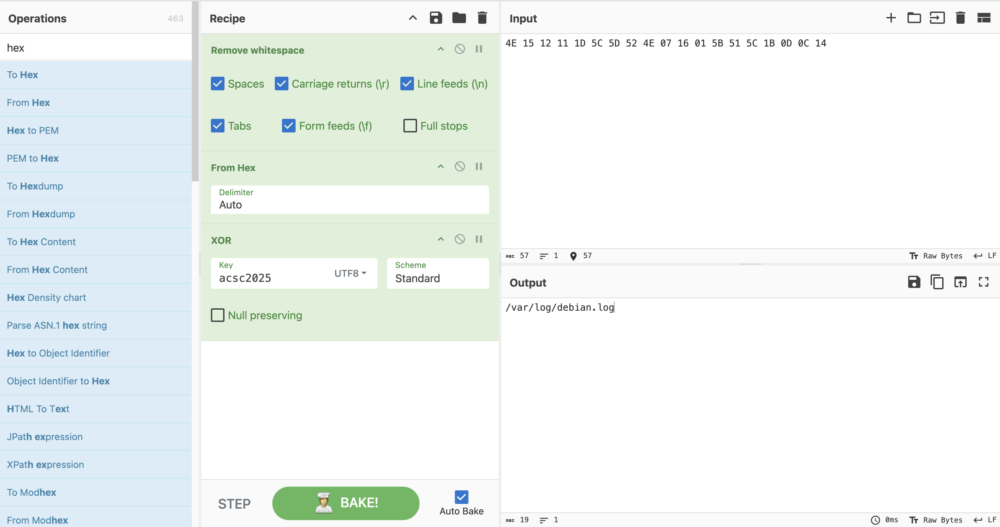

ok 知道了他會將隨機32 bytes 字串放進`/var/log/debian.log`中

現在解第二個xor解密字串

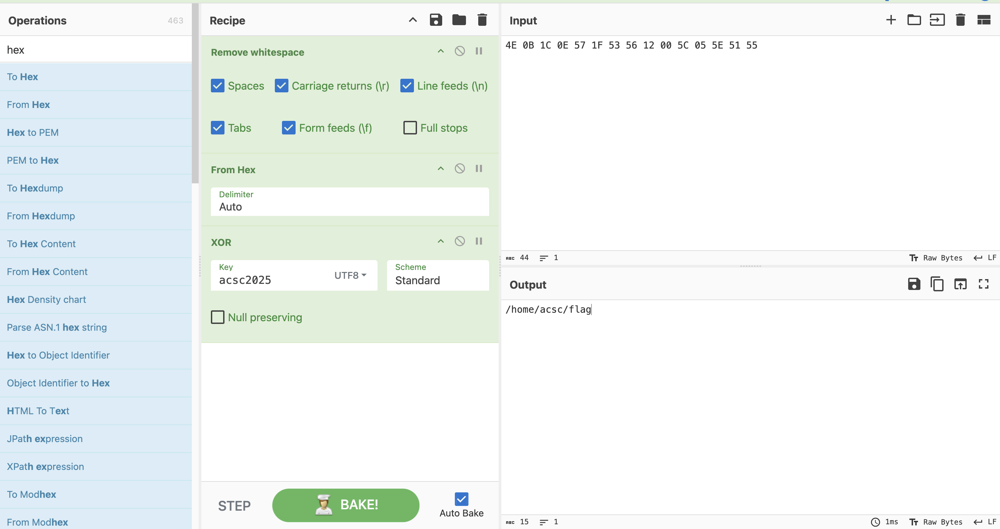

ok，這邊也得知道他會去`/home/acsc/flag`中將自容讀出來並加密他再寫回去。

有了以上資訊之後接下來要拿到 IV 與 KEY

## IV

加密過後的 IV 我們可以知道他會輸出到console 上，因此我們可以直接試試看strings 這個 linux 記憶體dump 他把它輸出的AES\_IV=XXX抓下來

```
strings "C:\Users\yunshiuan\Desktop\asac\chall.raw" | Select-String -Pattern 'AES_IV'
```

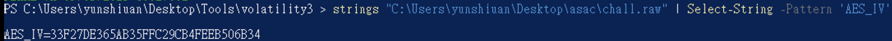

成功抓到後，接下來寫解密腳本，這邊請AI代寫，把原本的隨機16 bytes 字串還原

```c
#include <stdio.h>
#include <string.h>
#include <stdint.h>
#include <stdlib.h>

// Hex character lookup table (assuming standard hex characters)
char hex_chars[] = "0123456789ABCDEF";

// Function to decode hex string back to binary
void decode_hex_string(const char* hex_string, unsigned char* output, int length)
{
    for (int i = 0; i < length; i++)
    {
        // Get high nibble (first hex character)
        char high_char = hex_string[2 * i];
        // Get low nibble (second hex character)
        char low_char = hex_string[2 * i + 1];
        
        // Convert hex characters to values
        int high_val = 0, low_val = 0;
        
        if (high_char >= '0' && high_char <= '9')
            high_val = high_char - '0';
        else if (high_char >= 'A' && high_char <= 'F')
            high_val = high_char - 'A' + 10;
        else if (high_char >= 'a' && high_char <= 'f')
            high_val = high_char - 'a' + 10;
            
        if (low_char >= '0' && low_char <= '9')
            low_val = low_char - '0';
        else if (low_char >= 'A' && low_char <= 'F')
            low_val = low_char - 'A' + 10;
        else if (low_char >= 'a' && low_char <= 'f')
            low_val = low_char - 'a' + 10;
        
        // Combine high and low nibbles
        output[i] = (high_val << 4) | low_val;
    }
}

// Function to encode binary to hex string (original encoding function)
void encode_hex_string(const unsigned char* input, char* output, int length)
{
    for (int i = 0; i < length; i++)
    {
        output[2 * i] = hex_chars[(input[i] >> 4) & 0xF];
        output[2 * i + 1] = hex_chars[input[i] & 0xF];
    }
    output[2 * length] = '\0';
}

int main()
{
    // Given hex string
    const char* hex_string = "33F27DE365AB35FFC29CB4FEEB506B34";
    int hex_length = strlen(hex_string);
    int binary_length = hex_length / 2;
    
    printf("=== Hex Decoder ===\n\n");
    printf("Input hex string: %s\n", hex_string);
    printf("Hex string length: %d\n", hex_length);
    printf("Expected binary length: %d bytes\n\n", binary_length);
    
    // Allocate buffer for decoded data
    unsigned char* decoded_data = malloc(binary_length);
    if (!decoded_data) {
        printf("Error: Memory allocation failed\n");
        return 1;
    }
    
    // Decode hex string to binary
    decode_hex_string(hex_string, decoded_data, binary_length);
    
    // Print decoded data as hex
    printf("Decoded binary data (hex): ");
    for (int i = 0; i < binary_length; i++) {
        printf("%02X", decoded_data[i]);
    }
    printf("\n\n");
    
    // Print decoded data with spaces for readability
    printf("Decoded binary data (hex with spaces): ");
    for (int i = 0; i < binary_length; i++) {
        printf("%02X ", decoded_data[i]);
    }
    printf("\n\n");
    
    // Print decoded data as bytes
    printf("Decoded binary data (bytes): ");
    for (int i = 0; i < binary_length; i++) {
        printf("%d ", decoded_data[i]);
    }
    printf("\n\n");
    
    // Verify by re-encoding
    char* reencoded = malloc(hex_length + 1);
    if (reencoded) {
        encode_hex_string(decoded_data, reencoded, binary_length);
        printf("Re-encoded verification: %s\n", reencoded);
        if (strcmp(hex_string, reencoded) == 0) {
            printf("✓ SUCCESS: Re-encoding matches original!\n");
        } else {
            printf("✗ FAILED: Re-encoding does not match original!\n");
        }
        free(reencoded);
    }
    
    free(decoded_data);
    
    return 0;
}

```

輸出為

```
=== Hex Decoder ===

Input hex string: 33F27DE365AB35FFC29CB4FEEB506B34
Hex string length: 32
Expected binary length: 16 bytes

Decoded binary data (hex): 33F27DE365AB35FFC29CB4FEEB506B34

Decoded binary data (hex with spaces): 33 F2 7D E3 65 AB 35 FF C2 9C B4 FE EB 50 6B 34 

Decoded binary data (bytes): 51 242 125 227 101 171 53 255 194 156 180 254 235 80 107 52 

Re-encoded verification: 33F27DE365AB35FFC29CB4FEEB506B34
✓ SUCCESS: Re-encoding matches original!
```

得知到IV = `33F27DE365AB35FFC29CB4FEEB506B34`

## KEY 

那之前的資訊可以知道他會寫在`/var/log/debian.log`中，因此我們直接把他從記憶體dump 出來

```
python3 .\vol.py -f "C:\Users\yunshiuan\Desktop\asac\chall.raw" linux.pagecache.InodePages --find '/var/log/debian.log' --dump
```

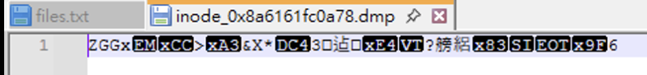

成功dump 之後直後就可以寫解密還原key，這邊一樣AI代寫解密腳本

```c
#include <stdio.h>
#include <string.h>
#include <stdint.h>
#include <stdlib.h>

// The key used in encryption
char aAcsc2025[] = "acsc2025";

// Decoy function (same as in encryption)
int64_t sub_402D55()
{
    int v0; // edx
    int64_t result; // rax
    int v2; // [rsp+0h] [rbp-8h]
    int i; // [rsp+4h] [rbp-4h]

    v2 = 305419896;
    for (i = 0; i <= 4; ++i)
    {
        v0 = i + 8 * v2;
        result = v0 ^ (unsigned int)v2;
        v2 ^= v0;
    }
    return result;
}

// Decryption function
uint64_t decrypt_data(int64_t encrypted_data, int64_t output_buffer, uint64_t length)
{
    uint64_t result; // rax
    char v5; // [rsp+1Ah] [rbp-Eh]
    uint64_t i; // [rsp+20h] [rbp-8h]

    for (i = 0LL; ; ++i)
    {
        result = i;
        if (i >= length)
            break;
            
        // Get the encrypted byte
        unsigned char encrypted_byte = *(uint8_t *)(encrypted_data + i);
        
        // Calculate rotation amount (same as encryption)
        int rotation_amount = (i & 7) + 1;
        
        // Reverse the bit rotation
        // Original: rotated = (value << (8 - rotation)) | (value >> rotation)
        // Reverse: value = (rotated >> (8 - rotation)) | (rotated << rotation)
        unsigned char rotated_value = (encrypted_byte >> (8 - rotation_amount)) | 
                                     (encrypted_byte << rotation_amount);
        
        // Extract v5: v5 = rotated_value - (i ^ 0x13)
        v5 = rotated_value - (i ^ 0x13);
        
        // Call the decoy function if the same condition is met
        if (((7 * (uint8_t)i + 13) & 1) == 0)
            sub_402D55();
            
        // Reverse the XOR with the key
        *(uint8_t *)(output_buffer + i) = v5 ^ aAcsc2025[i % 8];
    }
    return result;
}

int main(int argc, char *argv[])
{
    if (argc != 2) {
        printf("Usage: %s <encrypted_file>\n", argv[0]);
        return 1;
    }
    
    FILE *file = fopen(argv[1], "rb");
    if (!file) {
        printf("Error: Cannot open file %s\n", argv[1]);
        return 1;
    }
    
    // Get file size
    fseek(file, 0, SEEK_END);
    long file_size = ftell(file);
    fseek(file, 0, SEEK_SET);
    
    printf("File size: %ld bytes\n", file_size);
    
    // Read encrypted data
    unsigned char *encrypted_data = malloc(file_size);
    if (!encrypted_data) {
        printf("Error: Memory allocation failed\n");
        fclose(file);
        return 1;
    }
    
    size_t bytes_read = fread(encrypted_data, 1, file_size, file);
    fclose(file);
    
    if (bytes_read != file_size) {
        printf("Error: Could not read entire file\n");
        free(encrypted_data);
        return 1;
    }
    
    // Print encrypted data as hex
    printf("Encrypted data (hex): ");
    for (int i = 0; i < file_size && i < 50; i++) { // Show first 50 bytes
        printf("%02x ", encrypted_data[i]);
    }
    if (file_size > 50) printf("...");
    printf("\n");
    
    // Allocate buffer for decrypted data
    unsigned char *decrypted_data = malloc(file_size + 1);
    if (!decrypted_data) {
        printf("Error: Memory allocation failed\n");
        free(encrypted_data);
        return 1;
    }
    
    // Decrypt
    decrypt_data((int64_t)encrypted_data, (int64_t)decrypted_data, file_size);
    decrypted_data[file_size] = '\0';
    
    // Print decrypted data
    printf("\nDecrypted data:\n");
    printf("As hex (continuous): ");
    for (int i = 0; i < file_size; i++) {
        printf("%02X", decrypted_data[i]);
    }
    printf("\n\n");
    
    printf("As hex (with spaces): ");
    for (int i = 0; i < file_size; i++) {
        printf("%02X ", decrypted_data[i]);
    }
    printf("\n\n");
    
    printf("As text (if printable): ");
    for (int i = 0; i < file_size; i++) {
        if (decrypted_data[i] >= 32 && decrypted_data[i] <= 126) {
            printf("%c", decrypted_data[i]);
        } else {
            printf("\\x%02X", decrypted_data[i]);
        }
    }
    printf("\n");
    
    // Try to save decrypted data to a file
    char output_filename[256];
    snprintf(output_filename, sizeof(output_filename), "%s.decrypted", argv[1]);
    
    FILE *output_file = fopen(output_filename, "wb");
    if (output_file) {
        fwrite(decrypted_data, 1, file_size, output_file);
        fclose(output_file);
        printf("\nDecrypted data saved to: %s\n", output_filename);
    }
    
    free(encrypted_data);
    free(decrypted_data);
    
    return 0;
}

```

輸出

```
File size: 32 bytes
Encrypted data (hex): 5a 47 47 78 19 cc 3e a3 26 58 2a 14 33 a0 40 d0 b6 c8 d0 e4 0b a3 d1 ea f5 df 65 83 0f 04 9f 36 

Decrypted data:
As hex (continuous): C0685A143E2D38BA50244B4A753A31810B42F62D68D2D1D381165153E0C3F01F

As hex (with spaces): C0 68 5A 14 3E 2D 38 BA 50 24 4B 4A 75 3A 31 81 0B 42 F6 2D 68 D2 D1 D3 81 16 51 53 E0 C3 F0 1F 

As text (if printable): \xC0hZ\x14>-8\xBAP$KJu:1\x81\x0BB\xF6-h\xD2\xD1\xD3\x81\x16QS\xE0\xC3\xF0\x1F

Decrypted data saved to: inode_0x8a6161fc0a78.dmp.decrypted
```

得知到KEY = `C0685A143E2D38BA50244B4A753A31810B42F62D68D2D1D381165153E0C3F01F`

## 解密flag

知道了key跟IV之後，就可將flag檔案dump 出來並進行解密，這邊AES解密也是交給Cyberchef

```
C:\Users\yunshiuan\Desktop\Tools\volatility3 > python3 .\vol.py -f "C:\Users\yunshiuan\Desktop\asac\chall.raw" linux.pagecache.InodePages --find '/home/acsc/flag' --dump
```

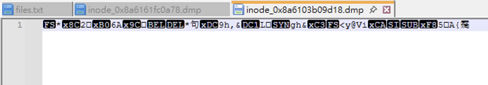

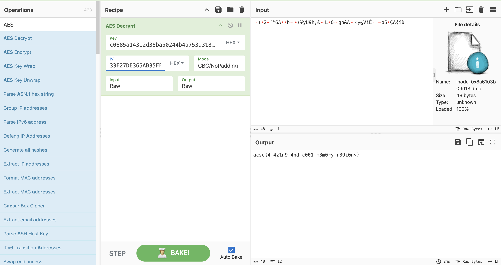

flag跑出來代表成功解出這題了！


# 總結

我覺得這題是挺不錯的，包含了Linux Memory Forensic 以及逆向的能力，賽中解出這題的成就感挺大的，確實如果我之前沒有接觸過 Linux 記憶體分析的話可能就會先耗在處理錯誤的地方一段時間。
