# 情境

本次實作實驗聚焦在 APT（高階持續性威脅）情境與勒索軟體情境。你將扮演 Alice Bluebird 的角色——剛被聘為 Wayne Enterprises 的 SOC 分析師，負責偵測與防禦各類網路攻擊。

## 場景 1（APT）：

今天是 Alice 在 Wayne Enterprises 安全部門（Security Operations Center，SOC）的第一天。Lucius 叫 Alice 坐下並給她第一個任務：一份來自高譚市警察局（Gotham City Police Department, GCPD）的備忘錄。GCPD 發現線上有證據（http://pastebin.com/Gw6dWjS9）顯示網站 www.imreallynotbatman.com 在 Wayne Enterprises 的 IP 位址空間內被入侵。該駭客組織有多重目標……但他們的作案手法之一是篡改網站以羞辱被害者。Lucius 要求 Alice 判定 www.imreallynotbatman.com（Wayne 企業執行長的個人部落格）是否確實遭到入侵。

在此情境中，使用者社群在瀏覽 Wayne Enterprises 網站時回報看到下列被篡改的圖片，且部分回報提到「P01s0n1vy」。若你不熟悉，P01s0n1vy 是一個曾針對 Wayne Enterprises 的 APT 組織。你作為 Alice 的目標是調查該網站篡改事件，並嘗試依照 Lockheed Martin Kill Chain 重建攻擊流程。


## 場景 2（勒索軟體）：

在第二個情境中，你的一位使用者在 Windows 桌面上看到一張圖片，表示系統上的檔案已被加密，必須付款才能取回檔案。看起來 Wayne Enterprises 有一台主機感染了 Cerber 勒索軟體，你的目標是調查這起勒索事件。

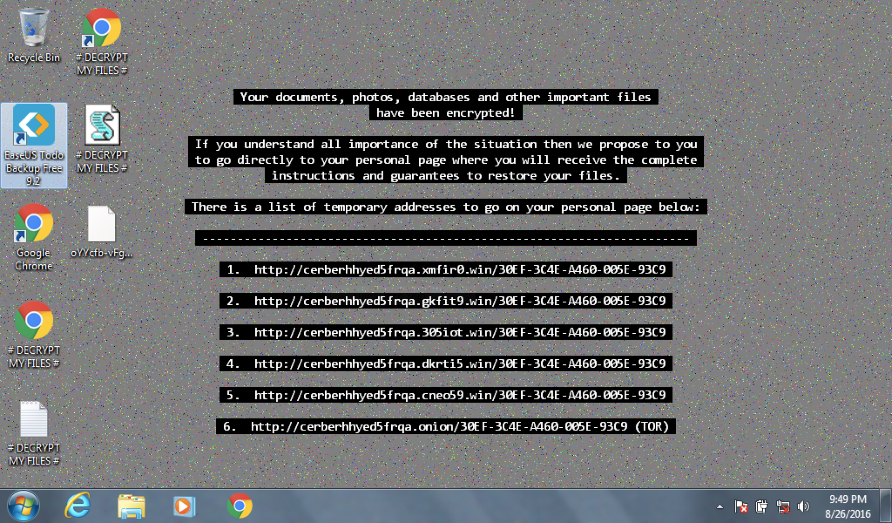

---

> Q1 : This is a simple question to get you familiar with submitting answers. What is the name of the company that makes the software that you are using for this competition? Just a six-letter word with no punctuation.

因為題目給的環境是 Splunk，這邊回答 splunk 即可。

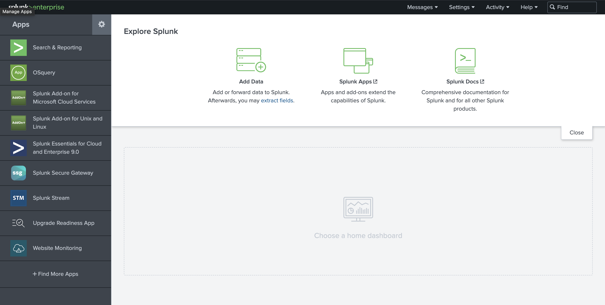

> Ans :  splunk

---

> Q2 : Web Defacement: What content management system is imreallynotbatman.com likely using? (Please do not include punctuation such as . , ! ? in your answer. We are looking for alpha characters only.)

題目想要找出 `imreallynotbatman.com` 網站使用了什麼 CMS 系統。

因此我們會用到 Search 功能。

來到 Search & Report 頁面在 Search 欄位搜尋：

```
index="botsv1" imreallynotbatman.com
```
在 Splunk 收到日誌或事件後，會根據設定儲存在不同的 index
這段搜尋語法的意思是在資料索引為botsv1中，找出字串中包含 `imreallynotbatman.com`。
data indexes 可以在 Setting-> DATA -> Index 中得知
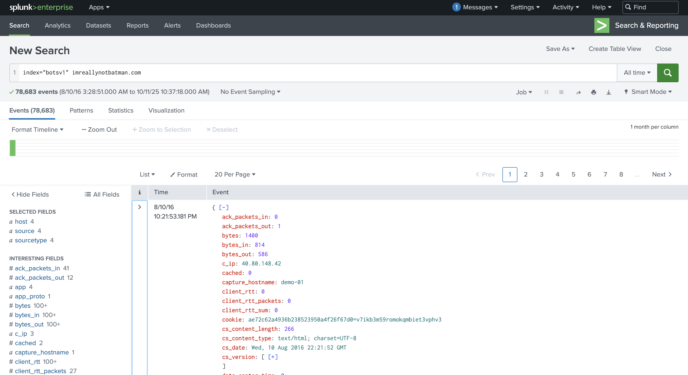

看第一個 Log 就可以發現使用的是 `joomla`。

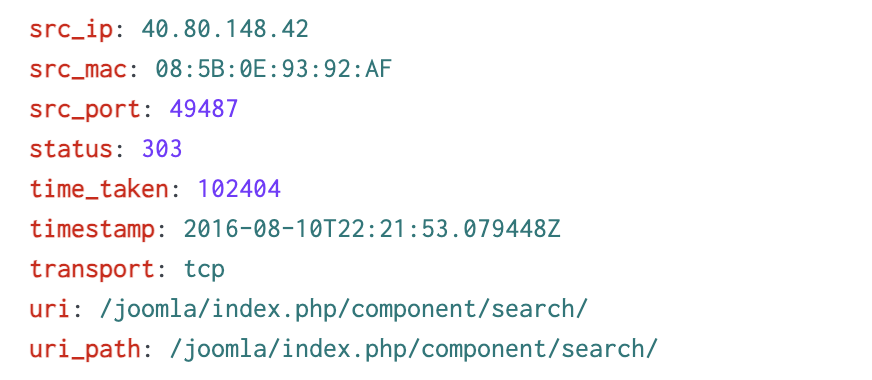

> ans : `joomla`

---

> Q3 : Web Defacement: What is the likely IP address of someone from the Po1s0n1vy group scanning imreallynotbatman.com for web application vulnerabilities?

接下來他想要找的是 Po1s0n1vy 用來掃描 imreallynotbatman.com 的 IP 是什麼？

有一個線索是知道這個 IP 有進行網頁漏洞掃描，有一個方向是我們可以使用在 Day17 提到的 Suricata，它會產生網路連接的 Log，因此我們搜尋的範圍可以限制在 Suricata 的 log 下，搜尋指令如下：

```
index=botsv1 sourcetype=suricata http.hostname=imreallynotbatman.com
```

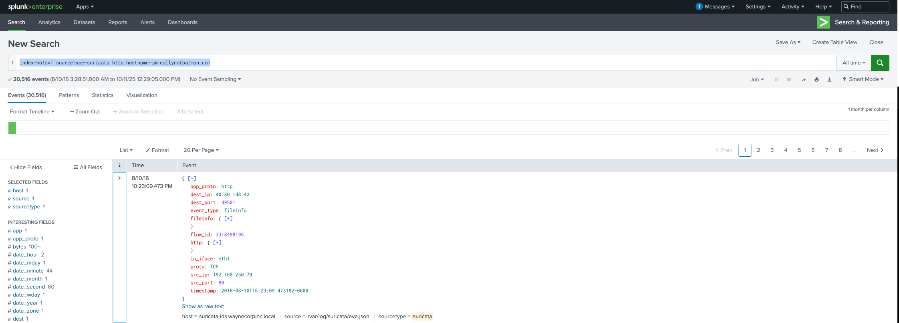

然後我們想要專注的是**來源 IP**，因此我們會需要用到 table 語法，它可以將我們想要的欄位單獨拉出來做一張表格，讓我們可以專注在分析這個欄位上。

```
index=botsv1 sourcetype=suricata http.hostname=imreallynotbatman.com 
| table src_ip
```

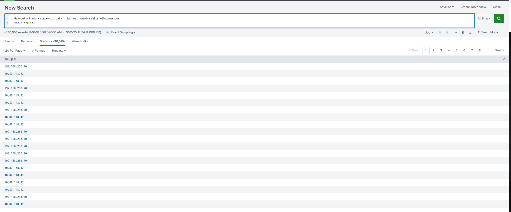

這邊我們獲得了每個 Suricata log 的來源 IP，接下來進行統計，因為我想要得到的是這個 IP 出現幾次，數量很多會有很高的機率是進行掃描，所以接下來會使用到 stats 語法，它提供了一些基本的統計功能。

```
index=botsv1 sourcetype=suricata http.hostname=imreallynotbatman.com 
| table src_ip 
| stats count by src_ip
```

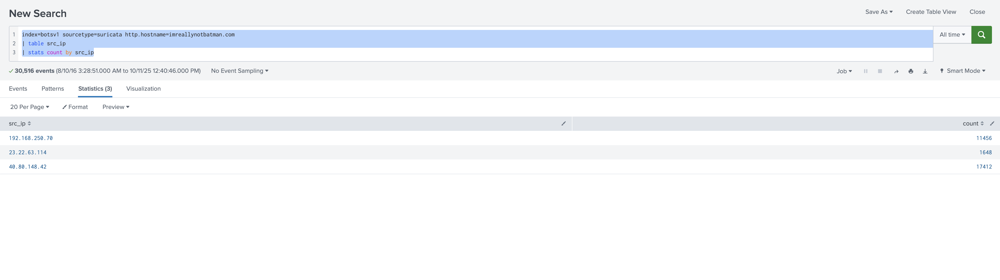

這樣就看得出來答案就是 `40.80.148.42`，另外如果想要數量由大排到小，可以使用 sort 語法，預設是由小排到大，加上 `-` 可以讓它變成由大排到小。

```
index=botsv1 sourcetype=suricata http.hostname=imreallynotbatman.com 
| table src_ip 
| stats count by src_ip 
| sort -count reverse
```

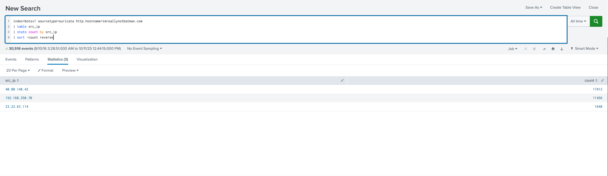

> ans : `40.80.148.42`

---

> Q4 : Web Defacement: What company created the web vulnerability scanner used by Po1s0n1vy? Type the company name. (For example, "Microsoft" or "Oracle")

這題想要搜尋到他們使用的 scanner 工具是什麼。

一樣我們可以使用 Suricata 工具，它除了可以產生網路連接 log 之外，還可以根據自訂規則產生警報，如抓到某個掃描工具的 Signature。

所以我們可以針對 Suricata 產生的 alert 去分析：

```
index=botsv1 sourcetype=suricata http.hostname=imreallynotbatman.com src_ip=40.80.148.42 alert
```

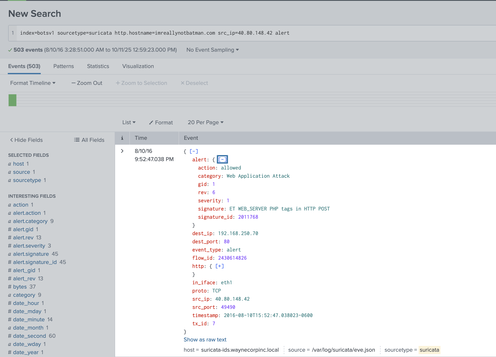

signature 欄位顯示偵測到的是什麼相關操作，因此我們用 table 專注去看 alert.signature 有沒有相關的線索：

```
index=botsv1 sourcetype=suricata http.hostname=imreallynotbatman.com src_ip=40.80.148.42 alert
| table alert.signature
```

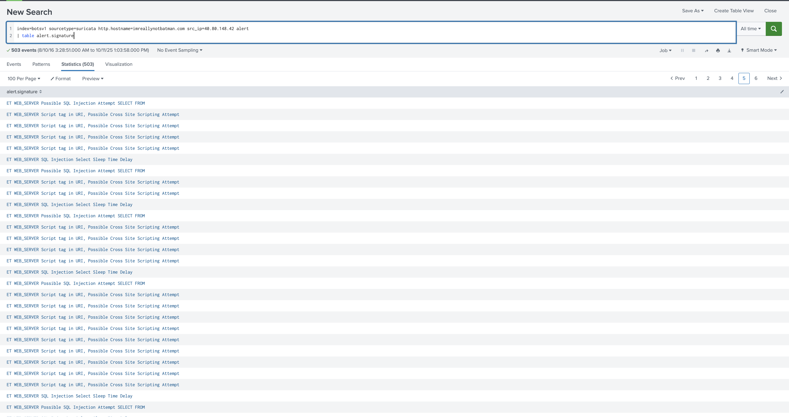

接下來就可以找到這個 value：

```
ET SCAN Acunetix Accept HTTP Header detected scan in progress
```

可以看出 Acunetix 就是我們需要的答案。

> ans : Acunetix

---

> Q5 : Web Defacement: What IP address is likely attempting a brute force password attack against imreallynotbatman.com?

要找到哪個 IP 在對 imreallynotbatman.com 進行暴力破解。

需要對網站進行帳號密碼的暴力破解，會需要用到 POST 的 method，我們可以針對 POST 操作做查看，並且也會需要知道 POST 帶的資料，確認是不是在做暴力破解，查詢可以用以下指令：

```
index=botsv1 http_method=POST dest_ip=192.168.250.70 sourcetype=stream:http
| table src_ip, form_data, uri
```

`sourcetype=stream:http` 代表是拿 Splunk Stream app 所收集到並且屬於 HTTP 流量資料，而 `dest_ip=192.168.250.70` 是 imreallynotbatman.com 的 IP，在前幾題的操作可以得知。

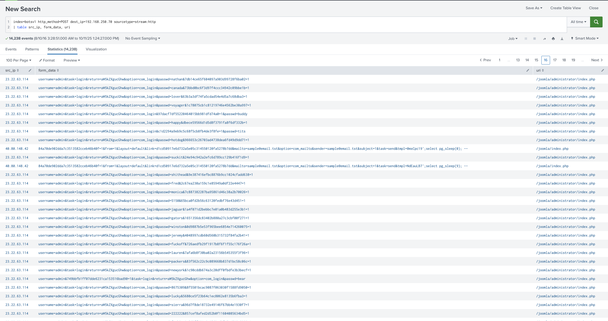

這邊可以看出來是 23.22.63.114 在進行暴力破解。

> ans : 23.22.63.114

---

> Q6 : Web Defacement: What was the first brute force password used

這題要獲得第一個暴力破解嘗試的密碼。

這題可以使用 sort 將時間排序：

```
index=botsv1 http_method=POST dest_ip=192.168.250.70 sourcetype=stream:http src_ip=23.22.63.114
| table src_ip, form_data, uri _time
| sort _time
```

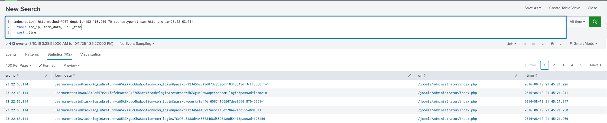

看到第一列的 password 參數是 12345678。

> ans : 12345678

---

> Q7 : Web Defacement: What is the name of the executable uploaded by Po1s0n1vy? Please include the file extension. (For example, "notepad.exe" or "favicon.ico")

這題要找的是 Po1s0n1vy 上傳的執行檔的檔名是什麼。

在 HTTP 中，如果上傳一個檔案會使用 `multipart/form-data`，代表會將不同 type 的資料透過一次請求傳送出去，因此我們可以用 `multipart/form-data` 縮小我們的搜尋範圍，另外語法也支援 regex，在搜尋執行檔上比較方便：

```
index=botsv1 http_method=POST dest_ip=192.168.250.70 sourcetype=stream:http multipart/form-data *.exe
```

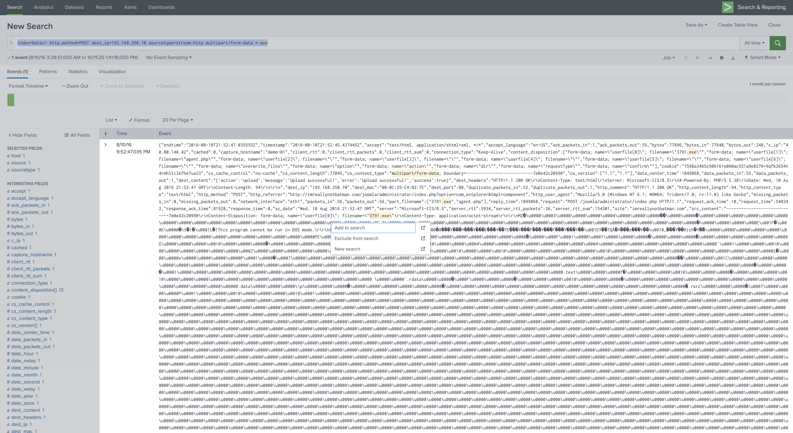

可以發現到上傳的執行檔檔名為 3791.exe。

> ans : 3791.exe

---

> Q8 : Web Defacement: What is the MD5 hash of the executable uploaded?

這題問 3791.exe 的 MD5 值是多少。

要取得 MD5 的值，會需要看關於 winlog 的紀錄，這邊會提到一個工具 - [Sysmon](https://learn.microsoft.com/zh-tw/sysinternals/downloads/sysmon)，它會記錄系統內發生的重要事件，包含 Process Create、Network Connect、檔案建立與變更、Registry Modification。 

以下是 Sysmon 的 Event ID：

### Sysmon

| Event ID | 說明                                 |
| -------- | ---------------------------------- |
| 1        | Process Create（程式啟動）               |
| 2        | File creation time changed（時間戳被修改） |
| 3        | Network connection（TCP 連線）         |
| 5        | Process Terminate（程式終止）            |
| 6        | Driver Loaded（驅動載入）                |
| 7        | Image Loaded（DLL載入）                |
| 8        | CreateRemoteThread（遠端執行緒注入）        |
| 9        | RawAccessRead（磁碟原始存取）              |
| 10       | ProcessAccess（程式存取他人記憶體）           |
| 11       | File Create（檔案建立）                  |
| 12       | Registry Key Create（註冊表鍵建立）        |
| 13       | Registry Value Set（註冊表值修改）         |
| 14       | Registry Key Delete（註冊表鍵刪除）        |
| 15       | FileCreateStreamHash（建立 ADS）       |
| 22       | DNS Query（DNS 查詢事件）                |
| 23       | File Delete（檔案刪除）                  |
| 25       | Process Tampering（程式記憶體被修改）        |
| 26       | File Deleted and Overwritten（防止取證） |
| 255      | Sysmon 設定被修改（Config change）        |

其中 Event ID = 1 有 MD5 可以查看，那這樣我們就搜尋 3791.exe 的執行紀錄，獲得它的 MD5 值：

```
index=botsv1 source = WinEventLog:Microsoft-Windows-Sysmon/Operational 3791.exe EventCode=1
```

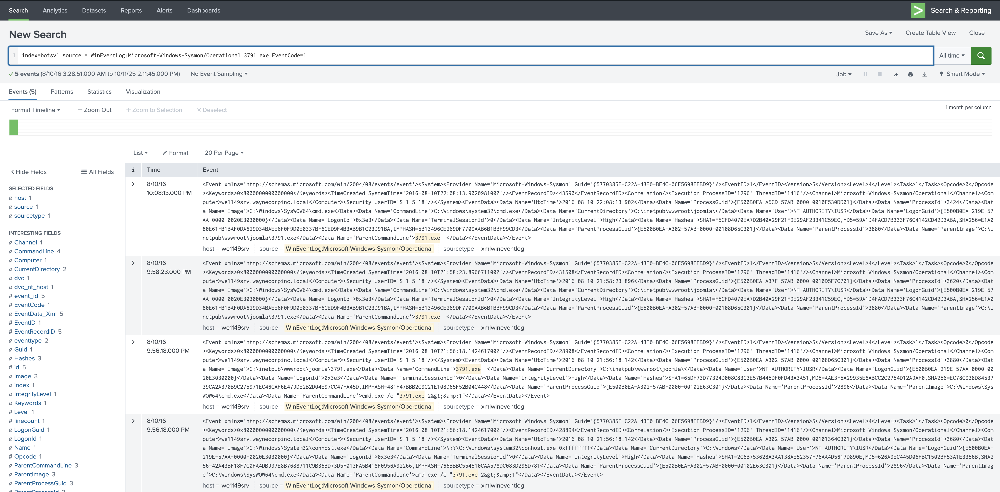

而我們專心看這個紀錄：

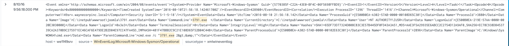

它的 ParentCommandLine 是 `cmd.exe/c "3791.exe2&gt;&amp;1`，以及這邊顯示的 `<DataName='Image'>C:\inetpub\wwwroot\joomla\3791.exe</Data><DataName='CommandLine'>3791.exe`，代表這個紀錄是關於 3791.exe 的資訊，所以往後面看它的 MD5 值是 AAE3F5A29935E6ABCC2C2754D12A9AF0。

> ans : AAE3F5A29935E6ABCC2C2754D12A9AF0

---

> Q9 : Web Defacement: What was the correct password for admin access to the content management system running "imreallynotbatman.com"?

這題想要問是哪個密碼成功進入了 imreallynotbatman.com。

我們可以在解 Q5 的時候知道登入的頁面是在 `/joomla/administrator/index.php`，並且它是用暴力破解的方式嘗試登入系統，所以如果有一個密碼與其他登入次數比其他的還多就有可能會是正確的密碼，但是它的密碼是放在 form_data 欄位，這個欄位會包含其他的文字資訊，因此我們會需要用到 rex 語法：


```
index=botsv1 dest_ip=192.168.250.70 sourcetype=stream:http http_method=POST uri=/joomla/administrator/index.php
| rex field=form_data "passwd=(?<pass>\w+)"
| stats count by pass
```

rex 的欄位說明如下：

* field=form_data：表示只在事件的 form_data 欄位內容中執行正規表達式（而不是整個 _raw）。
* "passwd=(?<pass>\\w+)"：正規表達式本體：
  * passwd=：字面匹配字串 passwd=（例如 HTML 表單或 HTTP body 裡的參數名）。
  * (?<pass>\\w+)：命名捕獲群組，會把匹配到的內容放到 Splunk 欄位 pass 中。
    * \\w+ 表示一或多個「字母、數字或底線（underscore）」。

原本的 form_data 長這樣：

```
username=admin&task=login&return=aW5kZXgucGhw&option=com_login&passwd=topgun&49e63c55a9730eee52c7ea0448de3a01=1
```

因此它會提取 `passwd=` 後面的字串，直到碰到不是字母、數字或底線為止，然後它會變成單獨的 pass 欄位。

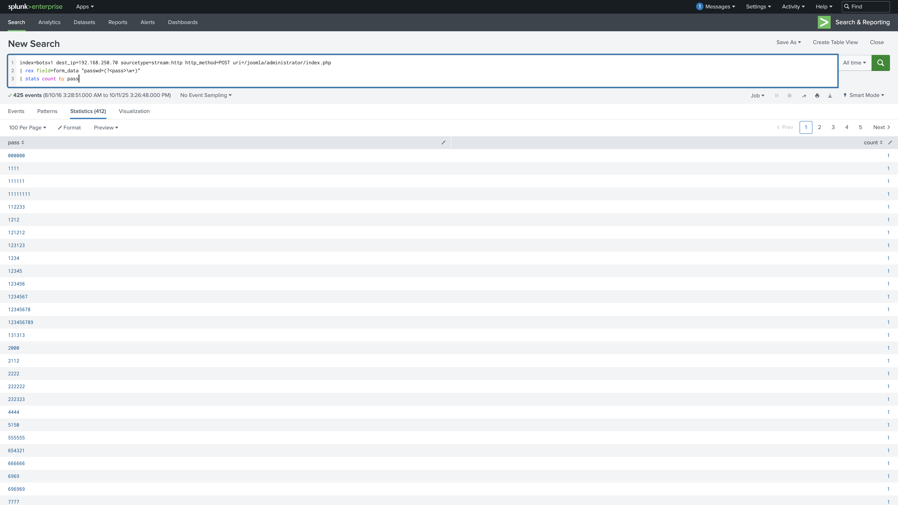


```
index=botsv1 dest_ip=192.168.250.70 sourcetype=stream:http http_method=POST uri=/joomla/administrator/index.php
| rex field=form_data "passwd=(?<pass>\w+)"
| stats count by pass
| sort -count
```

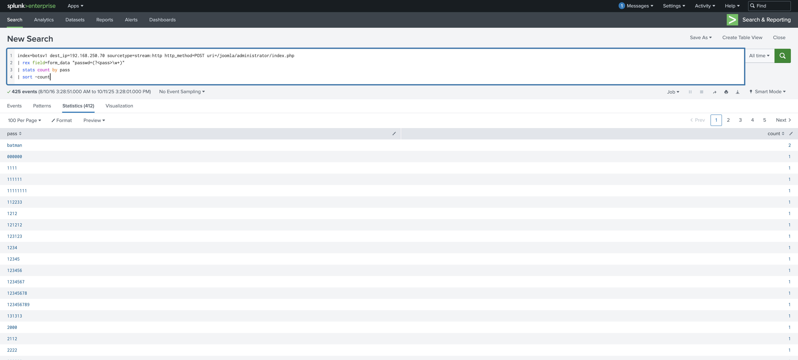

> ans : batman

---

> Q10 Web Defacement: What is the name of the file that defaced the imreallynotbatman.com website? Please submit only the name of the file with the extension (For example, "notepad.exe" or "favicon.ico").

題目想問是哪個檔案名稱污染了 imreallynotbatman.com 網頁。

這邊應該是想要問情境 1 當中進入網站出現一張圖片。

代表它之前可能會去下載過，因此可以用以下指令查詢它之前請求的頁面：

```
index=botsv1 sourcetype=stream:http src_ip=192.168.250.70 
| table site src_headers
```

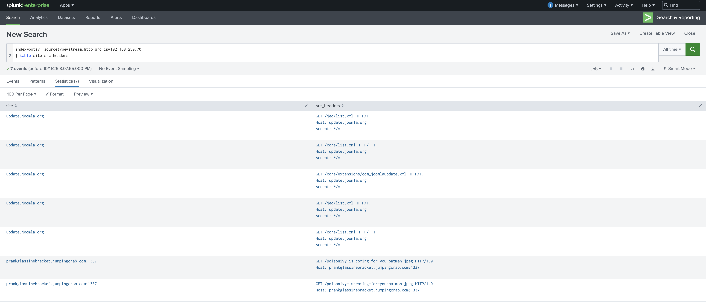

這邊可以看到它去一個網頁請求 `poisonivy-is-coming-for-you-batman.jpeg` 圖片，這個就是答案。

> ans : poisonivy-is-coming-for-you-batman.jpeg

---

> Q11 : Web Defacement: This attack used dynamic DNS to resolve to the malicious IP. What is the fully qualified domain name (FQDN) associated with this attack?

這題想要問是哪個FQDN 在進行攻擊

在Q10 可以看到 192.168.250.70 對prankglassinebracket.jumpingcrab.com 請求圖片，而prankglassinebracket.jumpingcrab.com 就是我們想要的答案


> ans : prankglassinebracket.jumpingcrab.com

---

> Q12: Web Defacement: What IP address has Po1s0n1vy tied to domains that are pre-staged to attack Wayne Enterprises?

從Q11 我們可以得到他去請求的 FQDN 叫做 `prankglassinebracket.jumpingcrab.com` ，我們可以再確認一下這個 FQDN 的 IP 是什麼

```
index=botsv1 sourcetype=stream:http src_ip=192.168.250.70
| table src_ip,dest_ip,site,src_headers
```

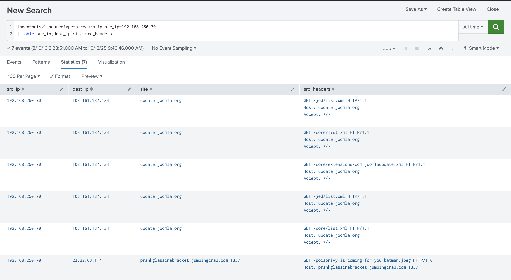

最下方可以看到 23.22.63.114 對應的 FQDN 就是 prankglassinebracket.jumpingcrab.com ，23.22.63.114 在Q5 我們確定它是在進行暴力破解登入後台，因此23.22.63.114 就是我們這題的答案

> ans : 23.22.63.114

---

> Q13 : Web Defacement: Based on the data gathered from this attack and common open-source intelligence sources for domain names, what is the email address most likely associated with the Po1s0n1vy APT group?

這題需要利用前面蒐集到的資料獲得 Po1s0n1vy APT 組織相關的電子郵件地址

總結一下我們目前得到的

* 23.22.63.114 (prankglassinebracket.jumpingcrab.com) : 暴破密碼，送圖片
* 40.80.148.42 : 掃描網頁漏洞

接下來我將23.22.63.114丟進 VirusTotal ，可以看到它之前解析為Po1s0n1vy.com

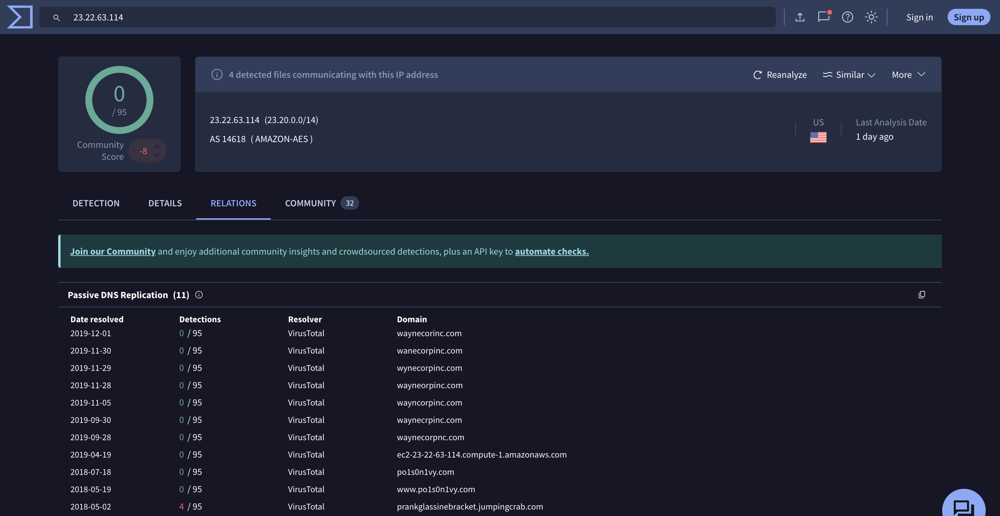

而在情境敘述中的備忘錄也有提到Po1s0n1vy.com這個網站

接下來可以使用 [whoxy](https://www.whoxy.com/) 這個網站，它可以幫我們查關於這個網域的資訊，另外也可以查詢誰之前擁有了這個網域。

查詢結果如下

https://www.whoxy.com/po1s0n1vy.com#history

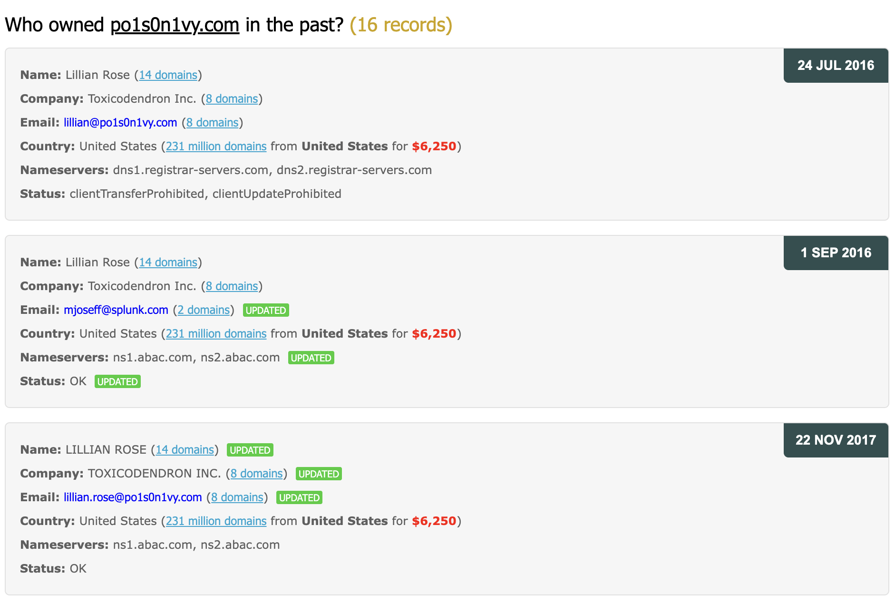

這邊可以看到 Email 是lillian.rose@po1s0n1vy.com 

這邊不是其他的email 是因為題目給的格式是`------*.---*@---------*.---`

> ans : lillian.rose@po1s0n1vy.com

---

> Q14 : Web Defacement: GCPD reported that common TTP (Tactics, Techniques, Procedures) for the Po1s0n1vy APT group, if initial compromise fails, is to send a spear-phishing email with custom malware attached to their intended target. This malware is usually connected to Po1s0n1vy's initial attack infrastructure. Using research techniques, provide the SHA256 hash of this malware.

題目說GCPD 報告指出Po1s0n1vy 如果初始的攻擊失敗，接下來會寄釣魚信件並戴上惡意附件，而這個惡意附件的程式會常常與Po1s0n1vy 的基礎攻擊設施做溝通，想問這個惡意程式的 SHA256

在 VirusTotal 中，關於 IP 會顯示之前出現惡意軟體與這個 IP 連線的功能，因此我們將23.22.63.114 丟進 VirusTotal 中，並選擇 Relation 頁面。

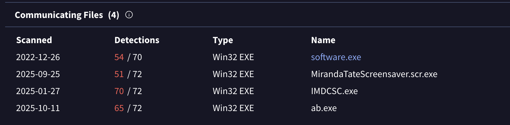

那經過嘗試答案會是 MirandaTateScreensaver.scr.exe ，點進去後就會拿到這個惡意程式的 sha256

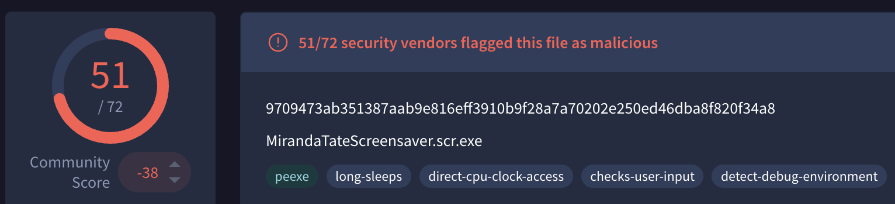

> ans : 9709473ab351387aab9e816eff3910b9f28a7a70202e250ed46dba8f820f34a8

---

> Q15 : Web Defacement: What is the special hex code associated with the customized malware discussed in the previous question? (Hint: It's not in Splunk)

這題想要得知前一題的惡意程式的special hex code

這題會需要看VirusTotal 的[Community](https://www.virustotal.com/gui/file/9709473ab351387aab9e816eff3910b9f28a7a70202e250ed46dba8f820f34a8/community) 頁面，因為有些人會在這邊貼出報告以及special hex code

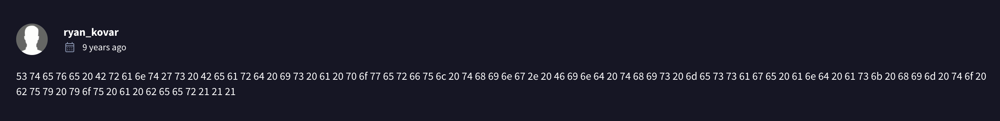

> ans : 53 74 65 76 65 20 42 72 61 6e 74 27 73 20 42 65 61 72 64 20 69 73 20 61 20 70 6f 77 65 72 66 75 6c 20 74 68 69 6e 67 2e 20 46 69 6e 64 20 74 68 69 73 20 6d 65 73 73 61 67 65 20 61 6e 64 20 61 73 6b 20 68 69 6d 20 74 6f 20 62 75 79 20 79 6f 75 20 61 20 62 65 65 72 21 21 21

---

> Q16 : Web Defacement: One of Po1s0n1vy's staged domains has some disjointed "unique" whois information. Concatenate the two codes together and submit them as a single answer.

題目說Po1s0n1vy 暫時架設的 domain 當中包含兩段分開出現的「唯一代碼／字串」，把那兩段代碼 串接成一個單一答案 提交

我們在 Q13 時用 VirusTotal 掃描這個 IP 它之前關聯的 domain，總共有以下 domain

* [waynecorpnc.com](https://www.virustotal.com/gui/domain/waynecorpnc.com)
* [ec2-23-22-63-114.compute-1.amazonaws.com](https://www.virustotal.com/gui/domain/ec2-23-22-63-114.compute-1.amazonaws.com)
* [po1s0n1vy.com](https://www.virustotal.com/gui/domain/po1s0n1vy.com)
* [prankglassinebracket.jumpingcrab.com](https://www.virustotal.com/gui/domain/prankglassinebracket.jumpingcrab.com)

我們每個都可以用 [whoxy](https://www.whoxy.com/) 查看

答案會在 waynecorpnc.com 中，但是現在已經找不到該domain 的詳細資訊了，所以我參考了其他人的 [writeup](https://jk105.gitlab.io/infosec/post/cyberdefenders_bossofthesoc1/) ，答案會在 company\_name 與 mailing\_address 中

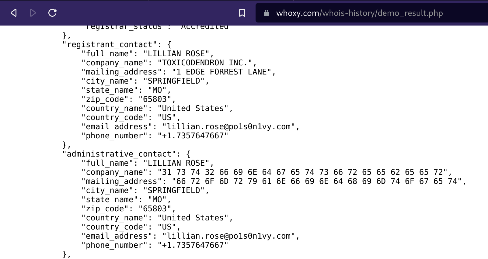

source : https://jk105.gitlab.io/infosec/post/cyberdefenders\_bossofthesoc1/

> ans : 31 73 74 32 66 69 6E 64 67 65 74 73 66 72 65 65 62 65 65 72 66 72 6F 6D 72 79 61 6E 66 69 6E 64 68 69 6D 74 6F 67 65 74

---

> Q17 : Web Defacement: One of the passwords in the brute force attack is James Brodsky's favorite Coldplay song. Hint: we are looking for a six-character word on this one. Which is it?

這題問的是爆破的密碼中有一個是James Brodsky's favorite Coldplay song ，要找出那個密碼

這題我們可以嘗試使用 splunk 的 lookup 功能，Splunk 的 lookup 是一種 查表功能，可以把外部資源（例如 CSV、KV Store 或自定義資料表）中的欄位值與事件資料中的欄位做匹配，然後把匹配到的欄位值加入到事件資料中以豐富資料內容


首先我們需要先獲得 Coldplay 的所有歌，[Kaggle](https://www.kaggle.com/datasets/faizalkarim/coldplay-albums-and-live-shows?resource=download) 網站中有人有整理出來，可以免費下載

接下來我們要匯入到 splunk 中，選擇Settings->Lookups

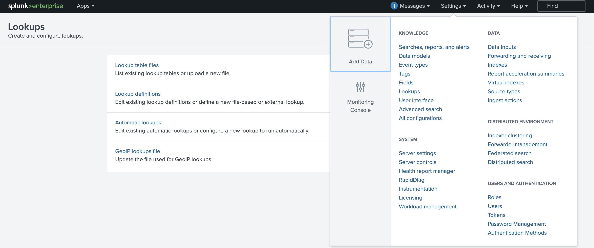

進入 Lookups頁面後我們要先新增 Lookup table ，點擊第一個的Add new ，將剛剛的下載的 csv 檔丟入

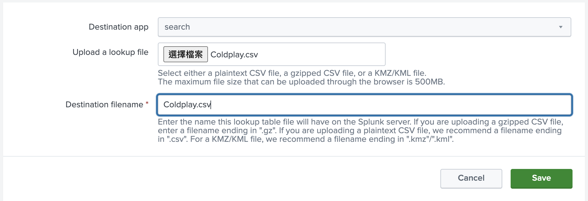

按下Save 之後要記得改權限，預設應該是Private ，要記得改成 Global 。

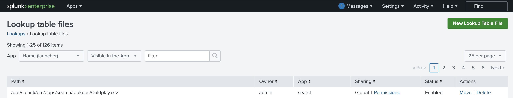

接下來要定義這個表的路徑以及欄位輸出方式

點選 Lookups 的首頁的第二行Add new ，接下來去指定剛剛丟進去的 csv 表，要記得開啟進階選項把 Case sensitive match 取消勾選

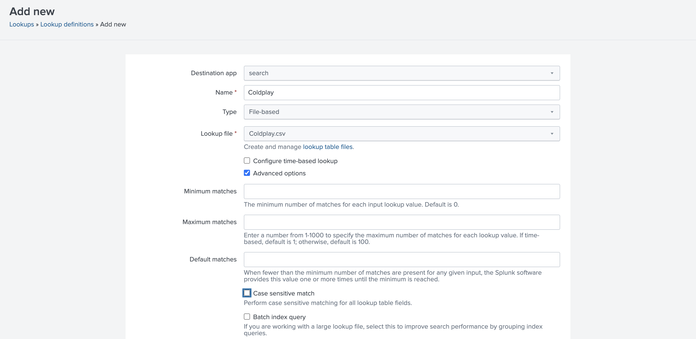

接下來就可以回到search 頁面使用 lookup 語法，匹配欄位資料

```
index=botsv1 dest_ip=192.168.250.70 sourcetype=stream:http http_method=POST uri=/joomla/administrator/index.php
| rex field=form_data "passwd=(?<pass>\w+)"
| lookup Coldplay name as pass output duration
| search duration=*
| table pass duration
```

lookup 的語法解說如下

* lookup Coldplay：呼叫名為 Coldplay 的 lookup 表格
* name as pass：將當前搜尋結果中的pass欄位對應到對應表的name欄位
* output duration：從 lookup 表格輸出 duration 欄位至事件資料

而加上search duration=\* 是因為只有被對應到的 pass 會出現duration，因此加上這個保證出來的會是匹配到的

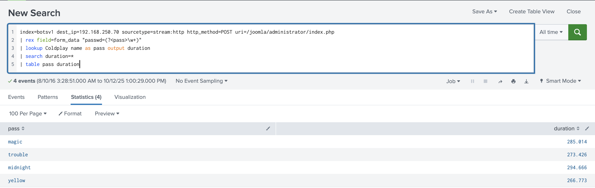

題目提示是六個字，因此是答案是yellow 

> ans : yellow

---

> Q18 : Web Defacement: What was the average password length used in the password brute-forcing attempt? (Round to a closest whole integer. For example "5" not "5.23213")

題目想要我們計算出所有嘗試的密碼長度

要計算 password 的平均長度，我們會需要使用到 eval 與 stats 幫助我們計算，eval 提供了基本的運算操作以及豐富的函式，[官方doc](https://help.splunk.com/en/splunk-cloud-platform/search/search-reference/10.0.2503/search-commands/eval)

```
index=botsv1 dest_ip=192.168.250.70 sourcetype=stream:http http_method=POST uri=/joomla/administrator/index.php
| rex field=form_data "passwd=(?<pass>\w+)"
| eval length = len(pass) 
| stats avg(length) as avglength 
| eval rounded = round(avglength, 0)
```

我們將pass提取出來後，使用len計算每一個pass 的長度，接下來用stats 提供的avg 計算所有欄位的平均長度，最後在使用 eval 的 round 幫我們做四捨五入操作

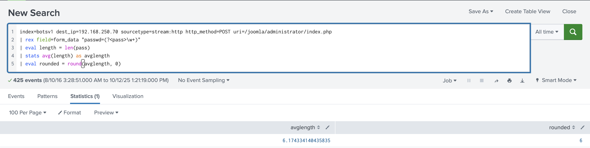

答案計算出來為 6

> ans : 6

---

> Q19 : Web Defacement: How many seconds elapsed between the brute force password scan identified the correct password and the compromised login? Round to 2 decimal places.

題目想要問識別出正確密碼到被成功登入之間經過了多少秒


我們在 Q9 得知了被爆破出來的密碼是 batman，因此我們先用 search 語法將 batman 密碼的請求先篩出來

```
index=botsv1 dest_ip=192.168.250.70 sourcetype=stream:http http_method=POST uri=/joomla/administrator/index.php
| rex field=form_data "passwd=(?<pass>\w+)"
| search pass="batman"
```

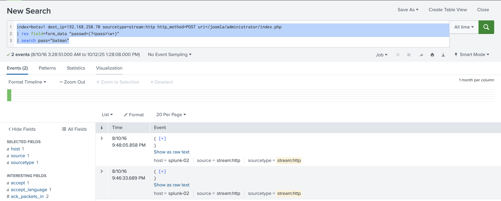

Time 欄位相減的秒數為 92.17

> ans : 92.17

---

> Q20 : Web Defacement: How many unique passwords were attempted in the brute force attempt?

題目想要問攻擊者嘗試了多少種密碼

這邊我們可以使用 stats 當中 dc 這個函式，dc 是 Splunk 中的去重計數函式 ，全稱為 "distinct count"

```
index=botsv1 dest_ip=192.168.250.70 sourcetype=stream:http http_method=POST uri=/joomla/administrator/index.php
| rex field=form_data "passwd=(?<pass>\w+)"
| stats dc(pass) as "attempt"
```

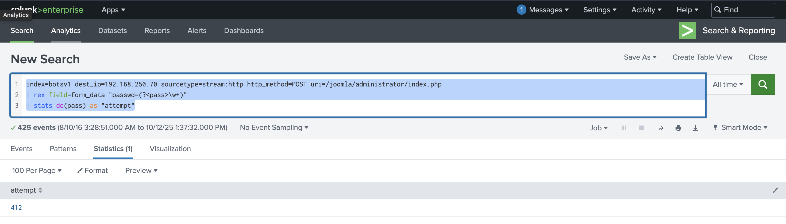

答案出來為412

> ans : 412

> Q21 : Ransomware: What fully qualified domain name (FQDN) makes the Cerber ransomware attempt to direct the user to at the end of its encryption phase?

題目敘述說惡意程式會讓使用者嘗試去請求 domain ，要找出FQDN


我想要先知道內部有哪些 IP 有在進行 DNS 查詢

```
index="botsv1" sourcetype="stream:dns"
| table src_ip
| stats count by src_ip
```

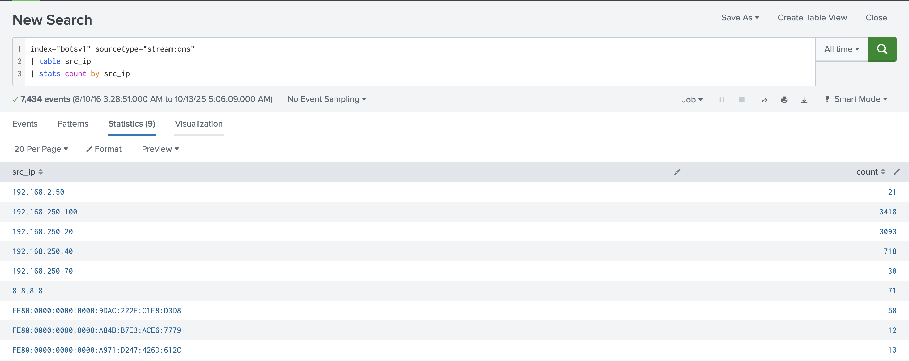

這邊知道192.168.2.50、192.168.250.100、192.168.250.20、192.168.250.40、192.168.250.70 這些內部 IP 有在進行 DNS 查詢，接下來我先看192.168.250.0/24 內 IP 查詢了哪些 domain，

```
index="botsv1" sourcetype="stream:dns" src_ip=192.168.250.0/24 
| table  src_ip,dest_ip,query{}
```

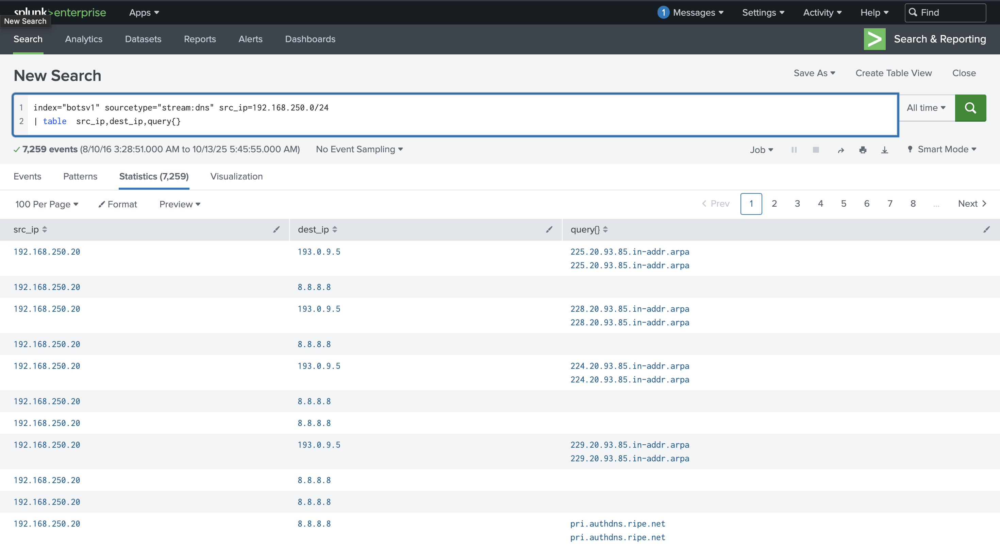

接下來會有很多其他的 DNS 記錄出來 我們可以點擊不可能是答案的 FQDN ，然後選擇 Exclude from result ，然後它就會在 Search 欄位中自動產出將此FQDN 排除查詢的語法。

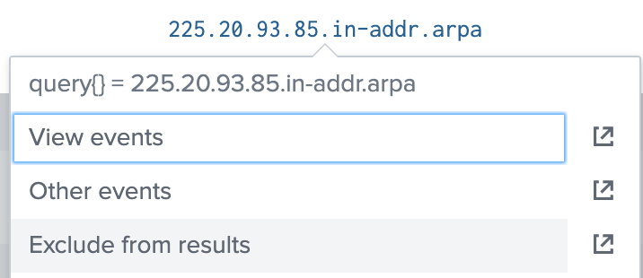

經過層層篩選後最後查詢如下

```
index="botsv1" sourcetype="stream:dns" src_ip=192.168.250.0/24  "query{}"!="*.in-addr.arpa" "query{}"!="demo-01"  "query{}"!="*.authdns.ripe.net"  "query{}"!="*.microsoft.com" "query{}"=*.*.* "query{}"!="*.waynecorpinc.local"  "query{}"!="dns.msftncsi.com"  "query{}"!="*.globalrootservers.net" 
| table  src_ip,dest_ip,query{}
```

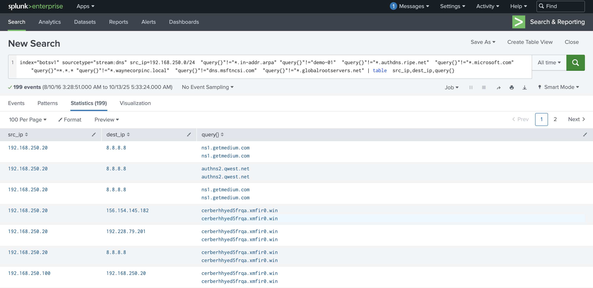

這邊可以看到 cerberhhyed5frqa.xmfir0.win 這個 FQDN，而這個網址在情境的圖片上有出現，因此是這題的答案

> ans : cerberhhyed5frqa.xmfir0.win

---

> Q22 : Ransomware: What was the most likely IP address of we8105desk in 24AUG2016?

題目想要問 we8105desk 這個 host 它最有可能的 IP 位置是什麼，時間限制在2016/08/24 中


首先先來調整時間，選擇時間並選擇 DataRange，調整為查詢08/24/2016 到 08/25/2016這段時間的資料

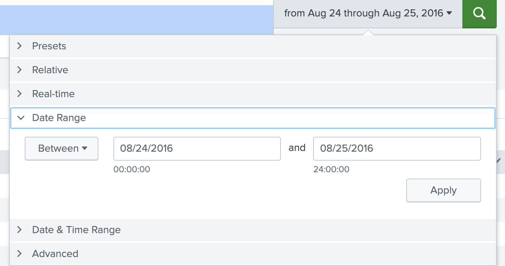

接下來查詢 host 為 we8105desk 的 source IP 記錄，因為是查詢 Sysmon 來源的關係所以是使用 SourceIp 當作查詢來源 IP

```
index=botsv1 host=we8105desk source=WinEventLog:Microsoft-Windows-Sysmon/Operational
| stats count by SourceIp 
| sort -count
```

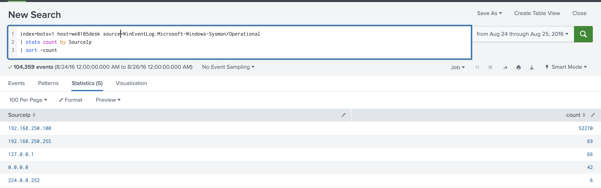

這邊可以看到答案是 192.168.250.100

> ans : 192.168.250.100

---

> Q23 : Ransomware: Amongst the Suricata signatures that detected the Cerber malware, which one alerted the fewest number of times? Submit ONLY the signature ID value as the answer. (No punctuation, just 7 integers.)

這題想要問 Suricata 產生的警報，當中關於 Cerber malware 出現最少的 signature 是哪一個

可以用以下的語法查詢，將 signature 與 signature\_id 抓出來

```
index=botsv1 sourcetype=suricata Cerber 
| table alert.signature alert.signature_id
```

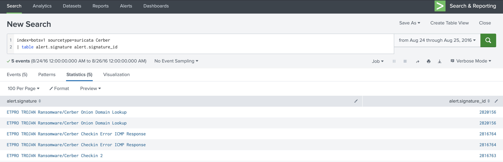

可以很明顯的看到 `ETPRO TROJAN Ransomware/Cerber Checkin 2` 這個 signature 只出現一次，而它的 id 為2816763 ，則為答案

> ans : 2816763

---

> Q24 : Ransomware: The VBScript found in question 25 launches 121214.tmp. What is the ParentProcessId of this initial launch?

這題需要先Q25，可以先去看 Q25 的解題過程

題目敘述說在Q25 找到 關於VBScript 是 121214.tmp被執行了，請問啟動這個VBScript 的父進程 ID 是什麼？

可以先將ParentImage、ParentProcessId以及CommandLine 抓出來查看

```
index=botsv1 sourcetype=xmlwineventlog *.vbs
| table ParentImage ParentProcessId CommandLine
```

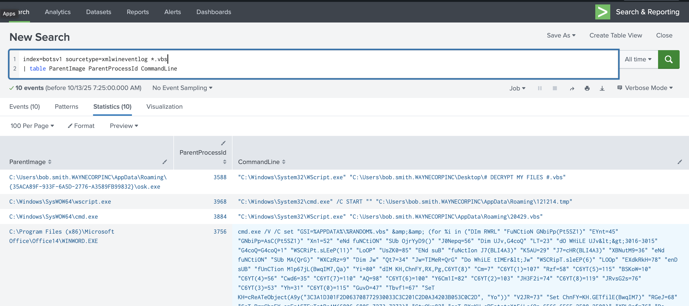

這邊可以很清楚的看到啟動121214.tmp 的父進程是 wscript.exe ，它的ID 為3968，這正是我們的答案

> ans : 3968

---

> Q25 : Ransomware: During the initial Cerber infection a VB script is run. The entire script from this execution, pre-pended by the name of the launching .exe, can be found in a field in Splunk. What is the length in characters of the value of this field?

題目敘述說當 Cerber 惡意程式執行時，初始會先執行 VB script，而這個 VB script 的產生包含前面啟動它的 exe 檔 可以在 Splunk 的其中一個欄位找到，最後問這個欄位裡面的值總共有多少 characters


看到題目敘述，可以直接聯想到的是 CommandLine 欄位，所以我們先把 EventLog 的 CommandLine 欄位抓出來，並且限制檔名為 .vbs

```
index=botsv1 sourcetype=xmlwineventlog *.vbs
| table CommandLine
```

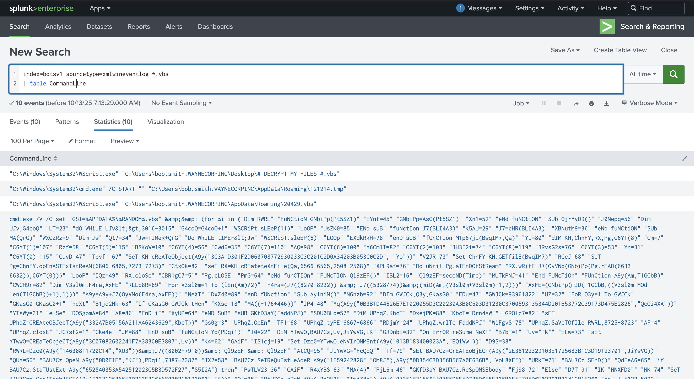

可以看到下面一大串的 cmd.exe........ 並且後面接 `GSI=%APPDATA%\%RANDOM%.vbs` 這邊就可以確定是題目所說。

接下來要計算裡面有多少字元，使用的是 eval 的 len 函式

```
index=botsv1 sourcetype=xmlwineventlog *.vbs
| eval cmdlenght=len(CommandLine)
| table CommandLine cmdlenght
```

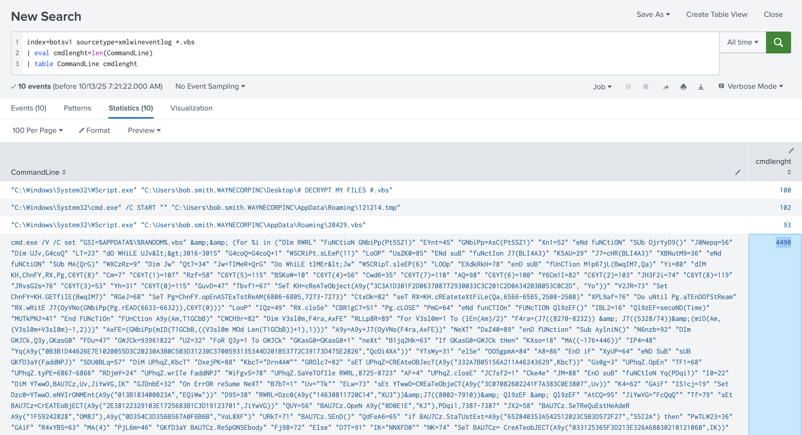

這邊它幫我們計算出答案為4490

> ans : 4490

---

> Q26 : Ransomware: The malware downloads a file that contains the Cerber ransomware crypto code. What is the name of that file?

題目敘述說惡意程式去下載一個包含 Cerber 勒索病毒加密程式碼的檔案，它的檔案名稱是什麼


我先把 192.168.250.100 (we8105desk) HTTP 的 GET 請求全部先抓下來

```
index=botsv1 source="stream:http" src_ip=192.168.250.100 http_method=GET
| table  src_ip,dest_ip,site,src_headers
```

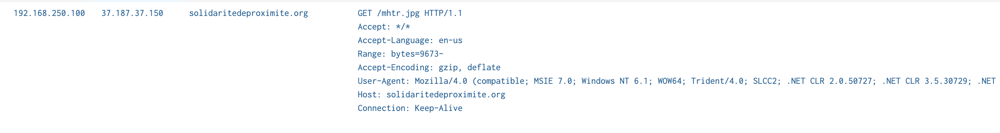

當中最可疑的是它向 `solidaritedeproximite.org` 請求一個 mhtr.jpg 檔案

我們單獨看一下關於有包含 mhtr.jpg 的記錄

```
index=botsv1 mhtr.jpg
```

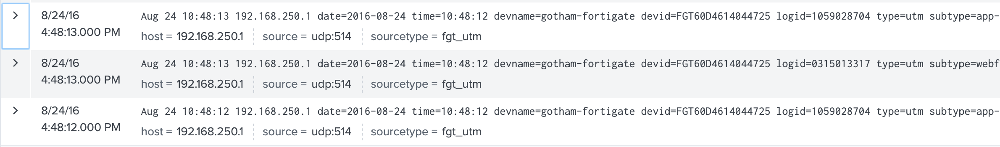

發現到有 `fgt_utm` 的記錄跳出來，在 Splunk 中通常指的是來自 FortiGate 防火牆的 Unified Threat Management 安全日誌類型的 sourcetype，用來記錄防毒、入侵防禦、網頁過濾等安全事件。


我們使用 fgt\_utm 記錄，並把 filename,msg,analyticscksum 欄位抓出來

```
index=botsv1 sourcetype="fgt_utm" mhtr.jpg
| table filename,msg,analyticscksum
```

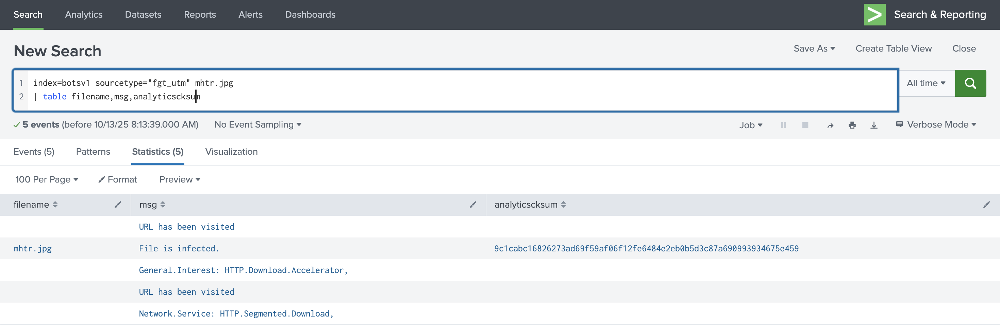

可以看到它偵測 mhtr.jpg 為惡意檔案，並且有 sha256 給我們，我們將它丟入 [VirusTotal](https://www.virustotal.com/gui/file/9c1cabc16826273ad69f59af06f12fe6484e2eb0b5d3c87a690993934675e459)

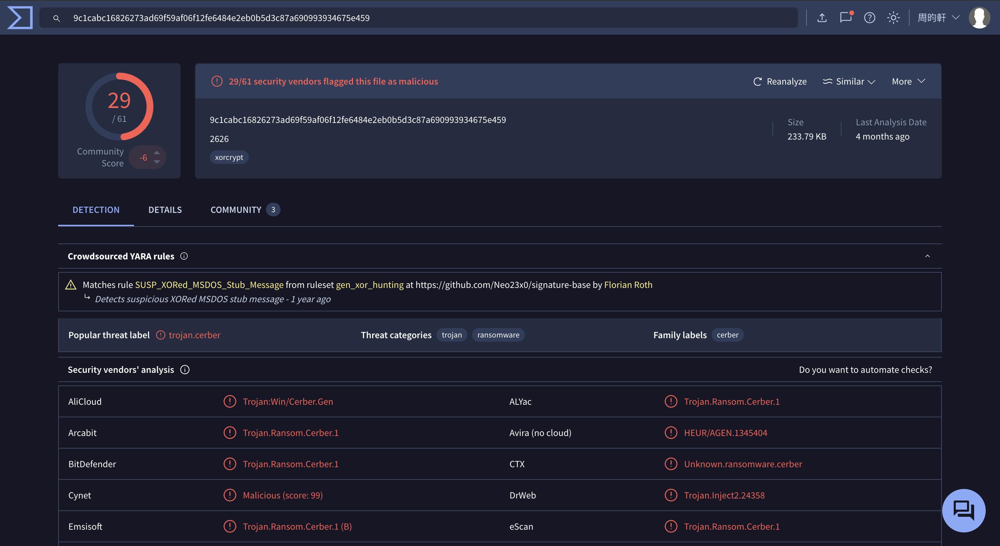

可以看到它是惡意程式，那 mhtr.jpg 就是我們的答案

> ans : mhtr.jpg

---

> Q27 : Ransomware: Now that you know the name of the ransomware's encryptor file, what obfuscation technique does it likely use?

題目問 mhtr.jpg 使用了何種混淆技術

jpg 可以被辨識出惡意程式，有很大的可能使用了隱寫術 (Steganography)，將惡意程式隱藏在圖片中，因此答案就是 Steganography

> ans : Steganography

---

> Q28 : Ransomware: What is the name of the USB key inserted by Bob Smith?

題目問 Bob Smith 插入的 USB 名稱是什麼

在 Splunk 中提供了一個 sourcetype，名稱為 winregistry，用來監控 Windows 註冊表 key／value 的建立、修改、刪除等操作。

另外關於 USB 的其中一個註冊表路徑會在 `SYSTEM\ControlSet001\USBSTOR`，主要用途是記錄曾經連接過的 USB 裝置資訊，例如製造商、產品、序號、FriendlyName 等等


因此我們將 `USBSTOR` 底下的 value 抓出來，並且用 dedup 將重複的 value 刪除，只保留第一筆出來的值

```
index=botsv1 source="winregistry" host=we8105desk USBSTOR
| table registry_value_data | dedup registry_value_data
```

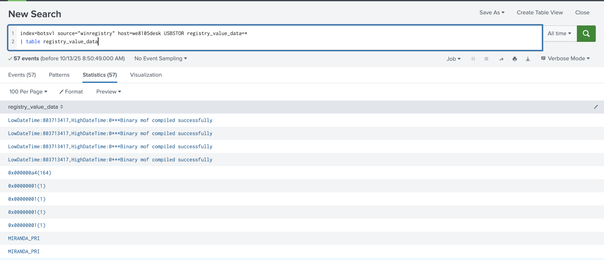

這邊就可以看到 USB 的名稱為 MIRANDA\_PRI

> ans : MIRANDA\_PRI

---

> Q29 : Ransomware: Bob Smith's workstation (we8105desk) was connected to a file server during the ransomware outbreak. What is the IP address of the file server?

題目敘述 Bob Smith's workstation 在 ransomware 執行期間去連線了 file server，請問 file server 的 IP 是什麼？

連線 file server 的 protocol 可能會有 SMB 或者 FTP，FTP 是空的，那我們可以著重去看 SMB

```
index=botsv1 sourcetype="stream:smb" src_ip=192.168.250.100
| table dest_ip
| dedup dest_ip
```

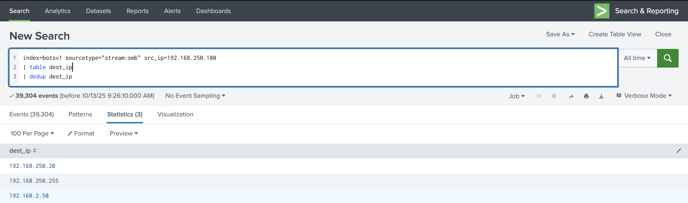

接下來要再更確認一點，file server 可能會進行登入，因此我們加上 login="bob.smith"

```
index=botsv1 sourcetype="stream:smb" src_ip=192.168.250.100 login="bob.smith"
| table dest_ip
| dedup dest_ip
```

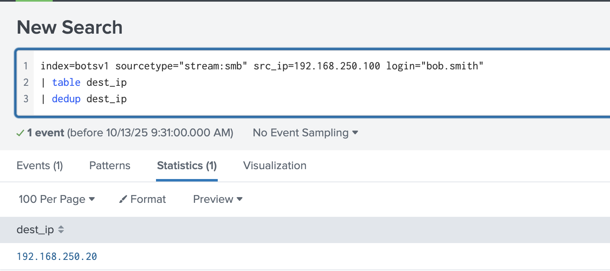

這樣就確定了 192.168.250.20 是 file server 

> ans : 192.168.250.20

---

> Q30 : Ransomware: How many distinct PDFs did the ransomware encrypt on the remote file server?

題目問有多少個遠端 pdf 被加密了

我們在上一題知道 file server 的 IP 為 192.168.250.20，我們另外先拿一下它的 domain name

```
index=botsv1 sourcetype="stream:smb" src_ip=192.168.250.100 dest_ip=192.168.250.20 path=*
| table path
```

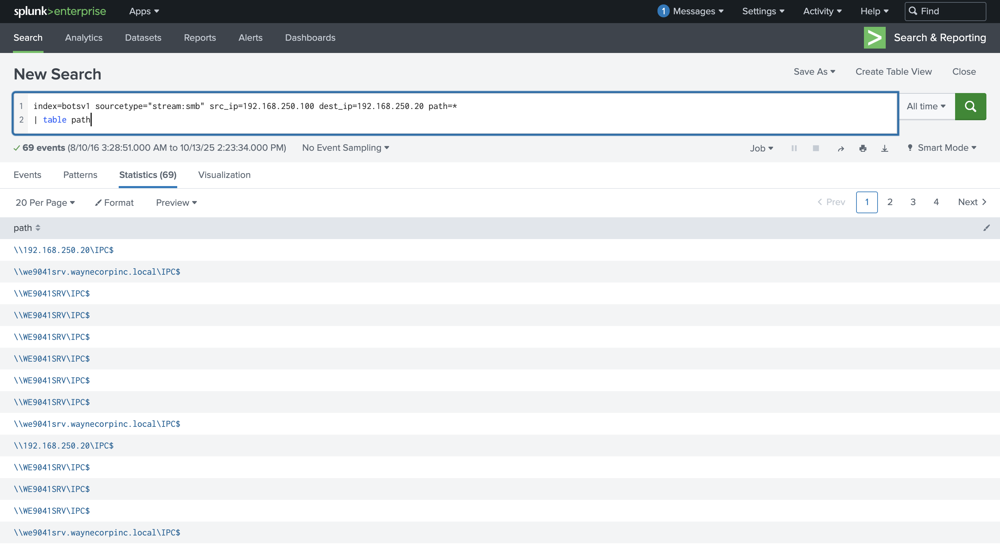

這邊得知了 domain name 為 we9041srv.waynecorpinc.local

首先我先搜尋 wineventlog 中有沒有關於 .pdf 的記錄

```
index=botsv1 sourcetype="wineventlog" *.pdf
```

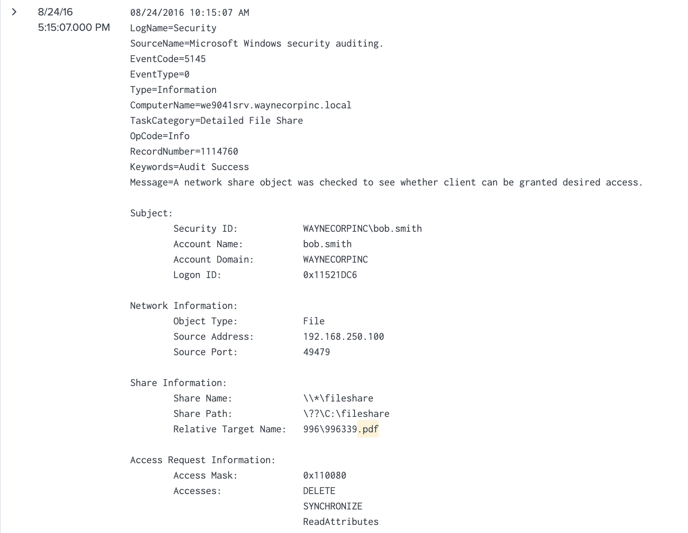

發現到有，並且是從 192.168.250.100 請求 we9041srv.waynecorpinc.local 的一個 pdf
因此我們將所有關於這個的記錄抓下來，並用 stats 中的 dc 幫我們算總共有幾個檔案

```
index=botsv1 sourcetype="wineventlog" *.pdf  EventCode=5145 Source_Address=192.168.250.100
| stats dc(Relative_Target_Name)
```

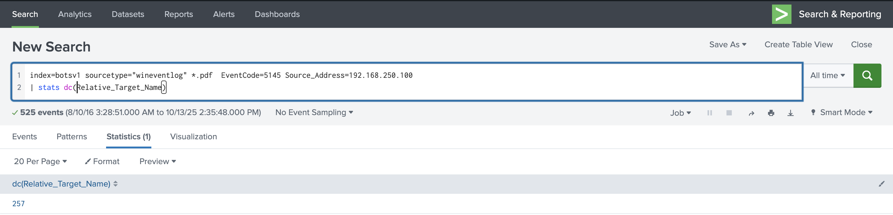

總共是 257 個，則 257 為答案

> ans : 257

---

> Q31 : Ransomware: The Cerber ransomware encrypts files located in Bob Smith's Windows profile. How many .txt files does it encrypt?

這題問的是在 Bob Smith 的電腦上有多少的 .txt 檔被 ransomware 鎖起來了

首先我們先使用 Sysmon 將針對 Bob Smith 內的 .txt 的操作抓下來，並且看是哪個檔案對 .txt 操作

```
index=botsv1 source="wineventlog:microsoft-windows-sysmon/operational" TargetFilename="C:\\Users\\bob.smith.WAYNECORPINC\\*.txt"
| table Image TargetFilename
```

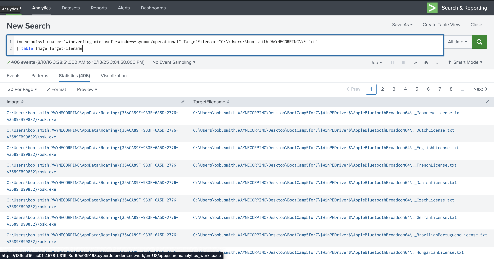

可以看到是有一個 osk.exe 對 .txt 檔做操作，

那我們可以 EventID=1 去看這個 osk.exe 的 hash 

```
index=botsv1 source="wineventlog:microsoft-windows-sysmon/operational" EventCode=1 Image="C:\\Users\\bob.smith.WAYNECORPINC\\AppData\\Roaming\\{35ACA89F-933F-6A5D-2776-A3589FB99832}\\osk.exe"
```

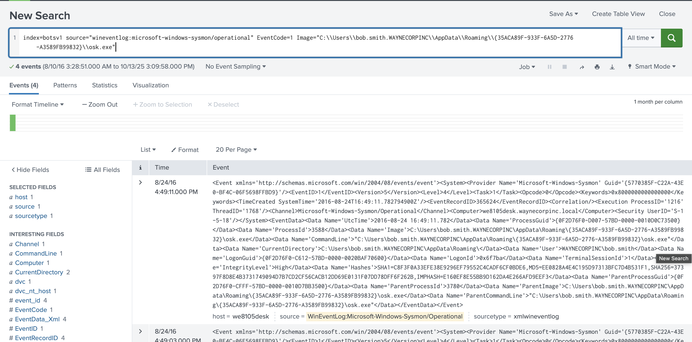

得到的 MD5 hash 為 [EE0828A4E4C195D97313BFC7D4B531F1](https://189ccf15-ac01-4578-b319-8cf69e039163.cyberdefenders.network/en-US/app/search/search?q=search%20index%3Dbotsv1%20source%3D%22wineventlog%3Amicrosoft-windows-sysmon%2Foperational%22%20EventCode%3D1%20Image%3D%22C%3A%5C%5CUsers%5C%5Cbob.smith.WAYNECORPINC%5C%5CAppData%5C%5CRoaming%5C%5C%7B35ACA89F-933F-6A5D-2776-A3589FB99832%7D%5C%5Cosk.exe%22\&display.page.search.mode=smart\&dispatch.sample_ratio=1\&workload_pool=\&earliest=0\&latest=now\&display.page.search.tab=events\&display.general.type=events\&sid=1760368198.162#)，丟進給 [VirusTotal](https://www.virustotal.com/gui/file/37397f8d8e4b3731749094d7b7cd2cf56cacb12dd69e0131f07dd78dff6f262b) 後

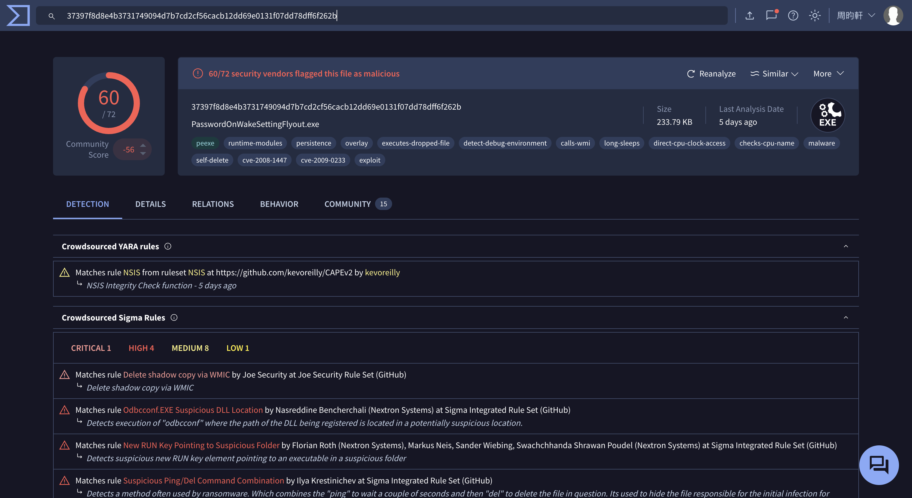

可以確定它是惡意程式

接下來針對這個 osk.exe 去計算所有 .txt 的數量

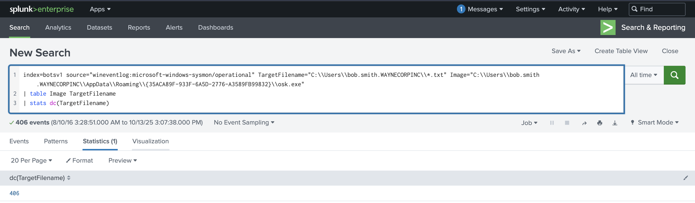

答案出來為 406，則 406 為這題的答案

> ans : 406

---

> Q32 : Ransomware: What was the first suspicious domain visited by we8105desk in 24AUG2016?

題目問 we8105desk 在 2016/08/24 時訪問了哪個可疑 domain？

我們在 Q26 中發現它會去向 `solidaritedeproximite.org` 請求 jpg 檔，而 `solidaritedeproximite.org` 則為這題的解答。

> ans : solidaritedeproximite.org
---

# 總結

今天分享了 Boss Of The SOC v1 的 Q1 ~ Q10 的解題過程，當中分享了一些 Splunk 的用法以及 Threat Hunting 的過程，明天會繼續分享 Boss Of The SOC v1 剩餘題目。
