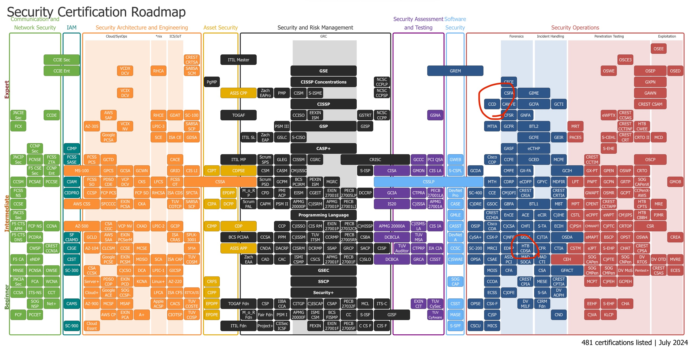
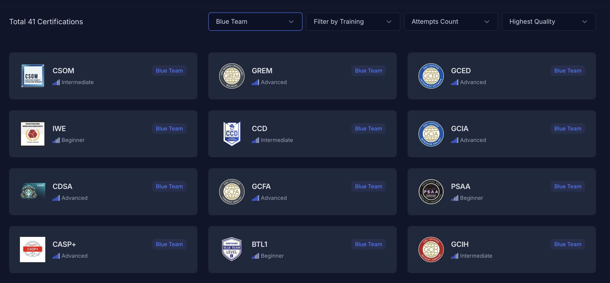
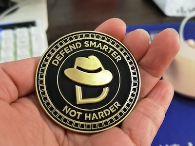
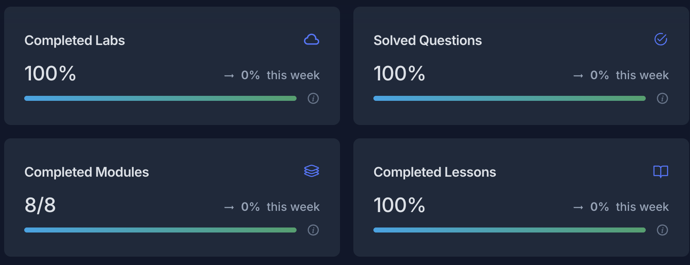
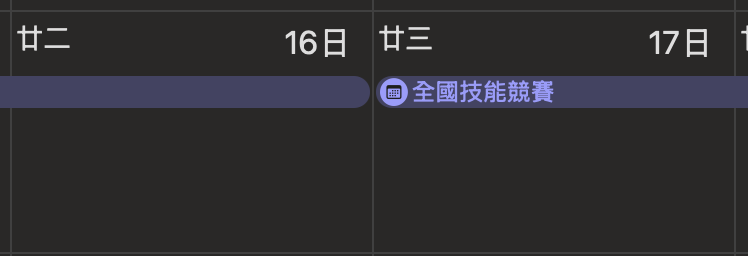
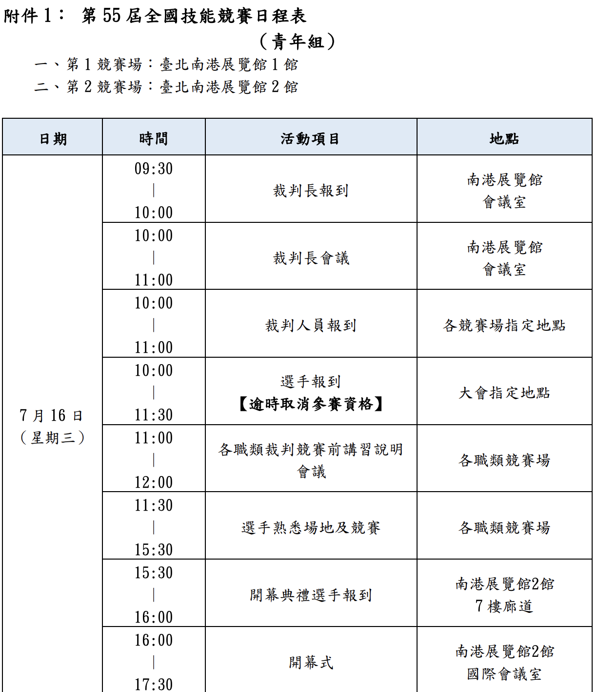
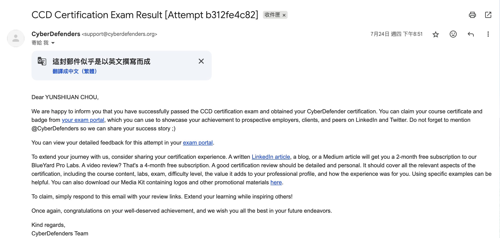
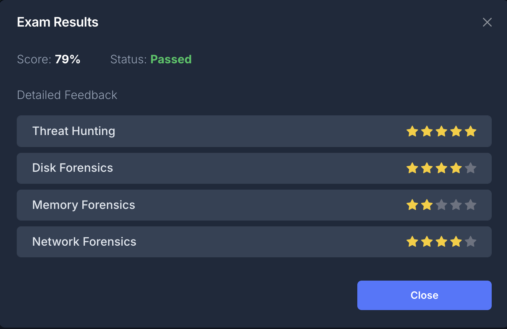
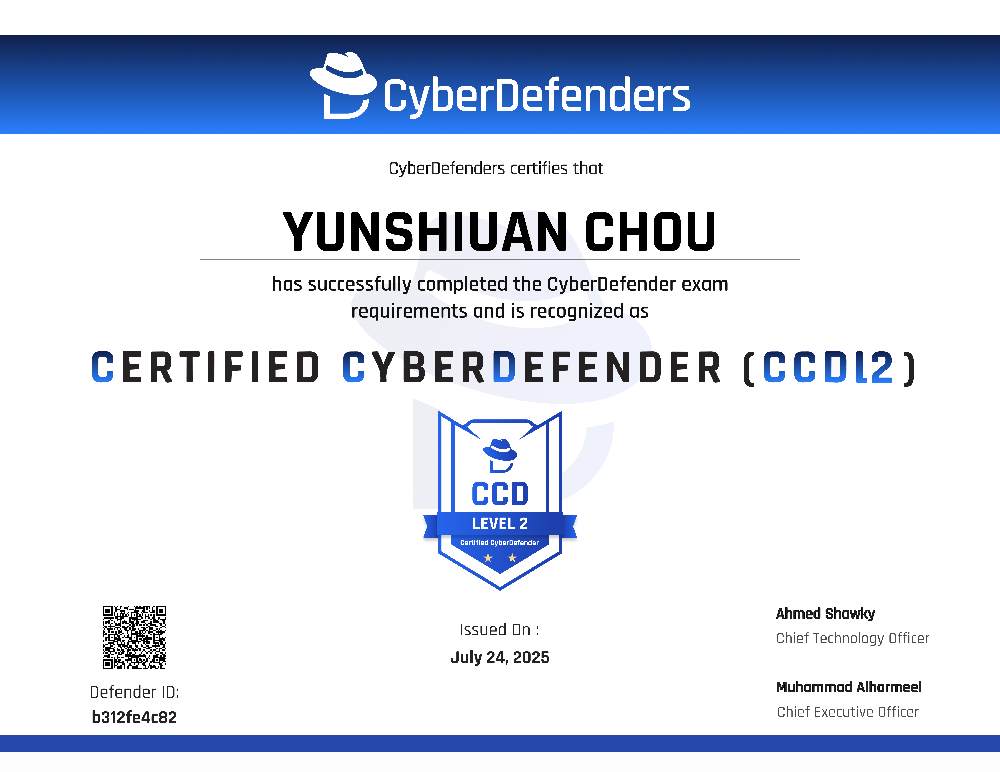

# 🧂 前言

> 2026/03/22 更新 現在 Cyberdefender 又推出了一張 CCD L1 證照，而本文考的 CCD 證照則是現在的 CCD L2。

鐵人賽的最後一天，我想要分享我在第一天提到的 Certified CyberDefender Certification L2，也是我考的第一張藍隊的證照，內容會包括考試內容、準備心得、考試過程......等等，並且似乎在中文圈還沒有人詳細介紹這張證照，~~我就當第一個首殺的了~~

***

# 關於 CCD L2

這邊先分享一下關於CCD L2 難度的問題

首先可以先看一下 [Paul Jerimy 整理的證照地圖](https://pauljerimy.com/security-certification-roadmap/)，整體可以看到 CCD L2 是排在挺高的地方，代表它是偏難並且不適合新手去考的，另外一個參照是 HTB 的 CDSA，它的難度是被認為是比 CCD L2 還要簡單的。

但是它在 [CyberDefender 的 RoadMap](https://cyberdefenders.org/community/cybersecurity-roadmap/) 中 CCD L2 是被評為比 CDSA 還要簡單的

我個人覺得 CCD L2 難度會取決於 Lab 以及課程的完成程度，如果全部 Lab 以及課程全部完成了那考試難度是中等，如果直接考那考試難度是偏高，Lab 以及課程接下來會介紹。

另一方面是價格的部分，CCD L2 的價格是 800 美金，而比較知名的 BTL2 它需要 2190 美金，所以考 CCD L2 也算一種~~省錢路線~~

我選擇這張證照的契機是我看到了這篇 [Reddit 論壇](https://www.reddit.com/r/cybersecurity/comments/1b6jnf5/ccdcertified_cyberdefender_certification_give_soc/?tl=zh-hant)，有一則留言說 CCD L2 雖然比 BTL1 較貴也較難，但在課程或考試上會收穫比較好，我選擇想要學比較多東西，因此選擇了挑戰 CCD L2 

## CCD L2考試介紹

CCD L2 是一個實作導向的 SOC 分析師認證，提供的課程包含以下內容

* 威脅狩獵
* 硬碟鑑識
* 邊界防禦-Email 安全
* 記憶體鑑識
* 網路鑑識
* 數位取證
* Incident Response
* 鑑識證據蒐集
* 惡意程式分析

課程幾乎包含了 SOC 分析師需要的所有相關知識，但是在考試時只會考以下內容，這裡也提一下主要使用的工具以及大致的內容

* 威脅狩獵
  * ELK
  * 給一個 APT 攻擊的情境，在 ELK 中找出攻擊過程
* 硬碟鑑識
  * Event Log Explorer
  * Eric Zimmerman's tools
  * 分析 Windows disk file
* 記憶體鑑識
  * Volatility2
  * 分析 Windows 記憶體
* 網路鑑識
  * Wireshark
  * Zui
  * NetworkMiner
  * 分析 pcap 封包

考試時間為 48 小時，考試過程沒有監考，可以查閱所有資料，包括它提供的教材，並且可以隨時開始進行考試，這 48 小時每個主題分別會給一個情境，並有數題題目，威脅狩獵的題目是最多的，有 20 題左右，另外三題皆為 10 題以內，總共會是 40 題左右。通過的分數為 70%，另外如果你考試分數到了 85% 會額外得到一個金色 Coin，**非常帥**，如果是 70%\~85% 是一個銀色的 Coin。

source : https://x.com/CyberDefenders/status/1645759783192915969

這個考試是不用寫報告的，但是你在回答問題時，它不會立即驗證你的答案是否正確，並且會需要在每一題的底下敘述解題過程，如果答案錯誤或者沒寫會根據你寫的內容判定是否部分給分。

在報名 CCD L2證照考試後它會提供教材以及 Lab 可以練習，Lab 全部做完的話會有 5% 的 bonus，但是這個 bonus 只會在如果你是 65%\~69% 時才會有加分。教材的部分是在一年內都可以存取，但是 Lab 只有 4 個月的存取時間，這些時間都是可以延長的，但就是要多花錢。

報名一次 CCD L2可以有兩次的考試資格，第一次考試必須在報名的 4 個月內考，第二次考試必須在報名的一年內考，意思是必須要在 4 個月內考至少一次，不然的話考試次數會被浪費掉。

考試結束後會在 14 個工作天內收到結果，並且會有每個主題的評分。

***

# CCD L2準備＋考試心得

在報 CCD L2之前，關於 SOC 分析師的相關技能我接觸過的有：玩過 Volatility、用過 Wireshark 會看封包，然後沒接觸過硬碟鑑識以及威脅狩獵，大概就是這樣，所以是偏新手的狀態，目標是希望拿到那酷酷的金色 coin。

## 考前準備

我是在 2025/05/04 時開始進行 CCD 的教材與 Lab 練習，是在 2025/07/14\~2025/07/16 進行 CCD 考試

中間經過了 2 個多月的時間，排除期末以及其他事情，大約是 1 個月左右的時間，這一個月時間我主要就是把教材全部翻過一遍，Lab 都做一遍，在做 Lab 之前是沒有官方解答的，做完閱讀詳解的權限才會開起來，我每個 Lab 平均花 3\~4 小時完成，在考試前 Lab 我原本已經快做完了，但是 CyberDefender 官方突然改版，每個主題多新增了 1\~2 個 Lab，然後原本的 Lab 變成不會計算在 bonus 的判定內，然後之前的題目詳解全部開放，變成要完成新增的那幾個 Lab 才會拿到 bonus，看到這改版直接傻眼，所以又花了億點時間做新增的題目，在考試前終於將全部的 Lab 完成了。

這邊大力推薦一下它的教材，它的教材做的非常豐富，每個主題都會有大量的工具以及概念，除了文字與圖片的講解之外，都還會有另外錄一次影片教學，有時候用文字看有點看不懂，但看影片操作一次就看懂了，並且教材內容都會從 0 開始教，所以如果是新手也可以聽得懂，另外它們會幫忙整理 Cheatsheet，讓我們在考試時可以看那張 Cheatsheet 找線索，因此學習這個教材讓我收穫很大。

在考前我也另外練習了 CyberDefender 裡面的免費 Lab，一開始碰到不會的就會直接開提示或官解，到後面練到一看到題目想問的就大概會有一個方向要去下什麼指令或者取哪個地方找線索，我覺得練習 Lab 還蠻重要的，提早適應一下考試的感覺，然後爬文時發現威脅狩獵的部分還蠻重要的，所以有多練習威脅狩獵的題目，結果來說真的是挺重要的。

## 考試過程

在 2025/07/14 第一天中午 11:00 左右按下開始後就進行了考試，總共有四大主題，威脅狩獵提供了 ELK 環境，硬碟鑑識、記憶體鑑識與網路鑑識提供了同一個 Windows 環境。我的順序是網路鑑識 -> 記憶體鑑識 -> 硬碟鑑識 -> 威脅狩獵

我一開始看網路鑑識，網路鑑識的題目比較簡單，主要用 Wireshark 就可以全解了，網路鑑識全部解完後，再進行記憶體鑑識以及硬碟鑑識，記憶體鑑識我有些題卡住之後就會轉去做硬碟鑑識，並且它們的每題的解題敘述都寫好寫滿，因為我覺得我有些題不太確定，但可惜的是只能寫 300 字，所以只能寫個大概而已，然後建議要在網路比較好的地方，不然寫一寫會當機，當時解到了 15 號的凌晨 3、4 點，進度在記憶體鑑識以及硬碟鑑識各解差不多 3/4 的進度以及威脅狩獵還沒有碰的情況下先跑去睡覺了。

第二天起來大約也快中午了，起床直接繼續解，將記憶體鑑識以及硬碟鑑識解完後開始碰威脅狩獵，記憶體鑑識以及硬碟鑑識我覺得整體難度中偏高，主要是 Volatility 的 Plugin 使用真的要很熟悉，以及 Event ID、註冊表位置會需要熟一點，建議一定要配一個 CheatSheet，忘記了可以直接看，不然會查到死。在威脅狩獵到一半，我突然接收到我隊友一個訊息，7/16 要去全國技能競賽報到，地點在北部，我現在在南部，然後我看了一下行事曆

我再重新看了一次全國技能競賽簡章

ok，完全記錯時間了，現在時間下午 5:45，腦袋風暴之後我計算出我只要在隔天凌晨 5:00 前解完然後搭客運衝上去就安全上壘了，因此開始刺激的瘋狂解題，結局是有完整的將威脅狩獵解完，並且每題都檢查一遍，威脅狩獵的題目整體中偏高，主要威脅狩獵都會需要使用到網路鑑識以及硬碟鑑識的概念，並且 ELK 的語法要很熟，所以難度會比硬碟鑑識與記憶體鑑識還要高一點。

整體考試給我的感覺時間其實給的挺充裕的，根據官方說法

>  設 48 小時是希望你有足夠時間，不要太過壓力。

另外考的內容有些會出現在課程的 Lab 中，所以考前會建議要把 Lab 全部都要完成，並且熟練每個操作。

## 考試結果

到了 7/24 號我收到了我通過的結果

除了開心以外，我期待我有沒有拿到金色的 coin，考過之後它會提供考試的結果以及每個主題的評分

可惜離拿到金色 coin 還有一點距離，然後我看到我的記憶體鑑識的評分讓我直接回去重讀記憶體鑑識，另外因為我不是當下截圖，我記得之前會詳細說每個主題評審給的建議以及回饋，但現在不見了，不確定之後會不會回來。

最後放上通過後的證書

~~另外到了現在 2025/10/14，我還沒收到我的銀色 coin QQ，如果來了會再補上~~

> 2026/03/22 更新 ， 拿到銀色 coin 了，

## 給目前考慮 CCD 的人

建議在付錢前要先評估 4 個月內有沒有空將時間投在 CCD 當中，因為會需要花大量時間練習以及閱讀教材，但是可以學到非常扎實且豐富的內容，對於沒有接觸過藍隊的玩家，可以先嘗試玩玩看 CyberDefender 裡面的免費 Lab，看是否有興趣再付錢也不遲。

## 給正在準備 CCD 證照的人

建議威脅狩獵的題目會需要多做一點，像是判斷誰在攻擊，如何攻擊，以及判斷的 MITRE ATT\&CK 的 TTP 會需要多練習，而且威脅狩獵題目很多，會需要比其他題目還要再熟練一點，不然會花太多時間在上面，另外會需要自己做筆記，因為過程中可能會出現這個事件是什麼 Event ID 或者這個設定的註冊表路徑在哪裡，做筆記會省非常多時間

***

# 總結

今天分享了 Certified CyberDefender Certification L2 的準備過程以及考試心得分享，今天也是鐵人賽的最後一天，這 30 天內分享了藍隊相關的技術與工具，包括了記憶體鑑識、OSINT、網路鑑識、硬碟鑑識以及威脅狩獵，最後以 Certified CyberDefender L2 這張證照作為結尾，~~然後我考完這張證照我的綽號突然多一個賽博守護者了~~，如果有任何問題都歡迎來跟我說～可以到我的 [Blog](https://yunshiuan.com/) 找到我的聯絡方式或者瀏覽其他我寫的內容，明年希望有空可再花 30 天跟大家分享。
