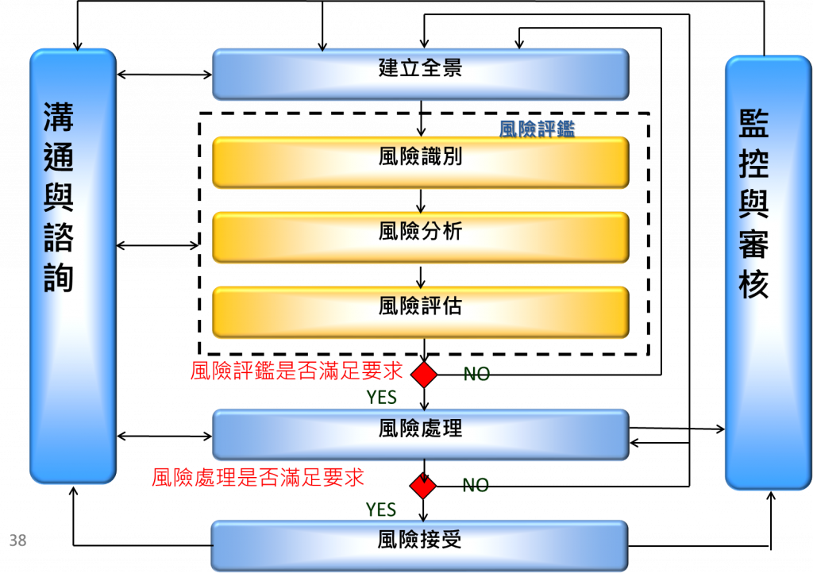
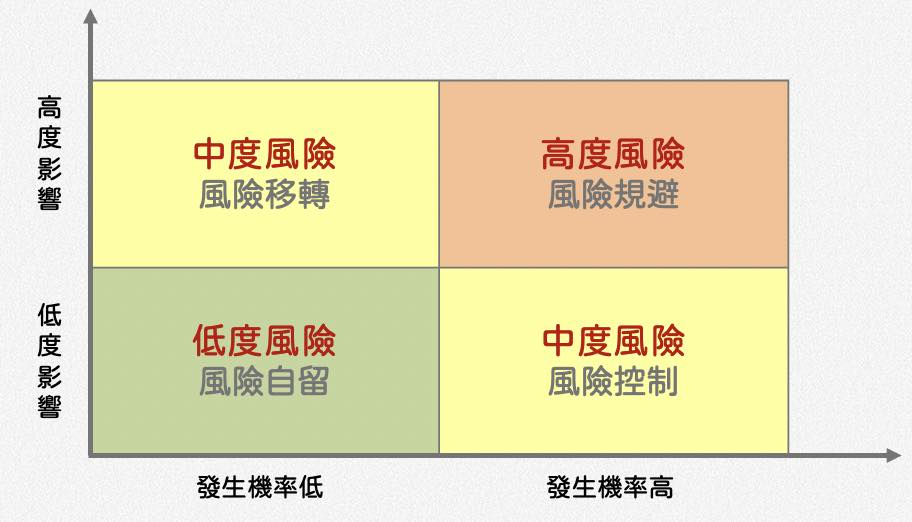
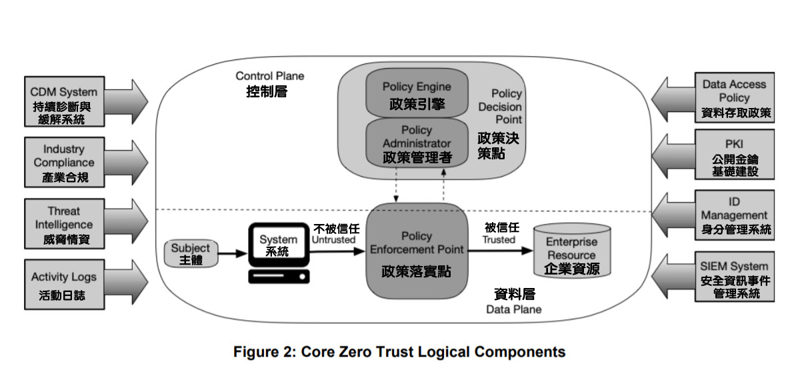
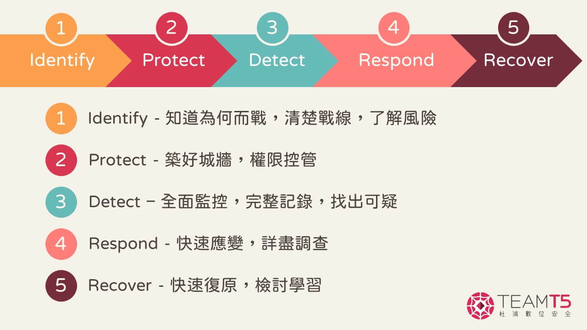

---
# 練習網址

* [歷屆考古題](https://drive.google.com/drive/folders/1bPd7Y4PRciqAFrMWPBZ29kps5O0Jh6b8)
* [iPas_資訊安全防護實務_中級_歷屆考題](https://docs.google.com/forms/d/e/1FAIpQLSeDBFyHoanvjsETYjJoxQPbWqaahISPuq-r3Gijr15folh1Cg/viewform)
* [iPas_資訊安全規劃實務_中級_歷屆考題](https://docs.google.com/forms/d/e/1FAIpQLScJGNb341MvMUCDjexHGYAlOuQnZGD5JJmaaurSd1g2OVpTjw/viewform) 

* [iPAS資安證照討論區 Q&A](https://hackmd.io/@hiiii/ryOzgaf0a)
* [iPAS資訊安全工程師中級筆記](https://hackmd.io/@Not/iPASInformationSecuritySpecialist)
---

# 筆記

## OSI 

| 7-layout     | Description                          |
| -----------  | ------------------------------------ |
| `應用層`      |   通訊協定，如：HTTP、FTP               |
| `表達層`      |   通訊過程中使用的編碼，如ASCII、JPEG     |
| `會議層`      |   控制開啟與關閉的通訊，檢查傳輸的完整性     |
| `傳輸層`      |   端對端之間的通訊、確保資料完整性          |   
| `網路層`      |   不同網路之間的資料傳輸(封包)：ip、ICMP    |
| `資料連結層`   |   同一網路上的兩個裝置之間的資料傳輸         |
| `實體層`      |   實體設備                                |

## 設備

### 橋接器 

* OSI 資料連接層
* 連接兩個不同區域網路的裝置

### RAID

| RAID 等級 | 最少磁碟數量 | 容錯能力 | 讀取效能 | 寫入效能 | 容量利用率 |
|-----------|--------------|------------|------------|------------|-------------|
| **RAID 0** | 2 | ❌ 無容錯 | 高 | 高 | 100% |
| **RAID 1** | 2 | 允許 1 顆故障 | 高 | 低 | 50% |
| **RAID 5** | 3 | 允許 1 顆故障 | 高 | 中 | (N-1)/N |
| **RAID 6** | 4 | 允許 2 顆故障 | 高 | 低 | (N-2)/N |
| **RAID 10** | 4 | 允許 1 顆（每個鏡像組） | 高 | 高 | 50% |

## 工具

### IDS/IPS
| 項目 | IDS（入侵偵測系統） | IPS（入侵防禦系統） |
|-------|---------------------|---------------------|
| **全名** | Intrusion Detection System | Intrusion Prevention System |
| **主要功能** | 偵測並報告惡意或異常行為 | 偵測、封鎖並防止惡意或異常行為 |
| **動作** | ✅ 監聽與記錄流量 ✅ 發出警報 | ✅ 監聽與記錄流量 ✅ 發出警報 ✅ 自動阻止攻擊 |
| **處理方式** | 被動（只發出警報，管理員需手動處理） | 主動（自動進行防禦與阻止） |
| **部署位置** | 內部網路或 DMZ | 通常部署在閘道或防火牆之後 |
| **對流量影響** | 不影響流量 | 可能影響效能（因為需要即時分析和處理） |
| **處理技術** | - 簽章比對 - 行為分析 - 協議異常檢測 | - 簽章比對 - 行為分析 - 協議異常檢測 - 即時封鎖 |
| **偵測方法** | - 簽章式偵測 - 異常行為偵測 | - 簽章式偵測 - 異常行為偵測 - 回應式處理 |
| **優勢** | ✅ 不會影響網路效能 ✅ 可用來調查攻擊來源 | ✅ 可即時封鎖攻擊 ✅ 自動處理無需人力介入 |
| **缺點** | ❌ 無法即時阻止攻擊 ❌ 需要人工干預 | ❌ 錯誤封鎖可能影響正常服務 ❌ 可能降低網路效能 |
| **適用場合** | - 需進行攻擊監控與記錄 - 調查及取證用途 | - 需即時防禦攻擊 - 防止 DDoS 或零時差攻擊 |
| **常見工具** | - Snort - Suricata - Bro（Zeek） | - Snort（IPS 模式） - Suricata（IPS 模式） - Palo Alto Networks - Cisco Firepower |

## 攻擊Attack

### 中國菜刀 China chopper
通過向網站提交一句簡短的程式碼,來達到向伺服器插入木馬,並最後獲取 webshell

---

## 基礎度量群 Base Metric Group
基本度量群組考慮的是與漏洞本身相關的特徵，例如攻擊向量、攻擊複雜度、身份驗證要求、機密性影響、完整性影響和可用性影響等等。

### Threat Metric Group

### 環境度量群 Environmental Metric Group
漏洞在特定使用者環境下的影響。這些因素可以包括組織特有的需求和限制，例如資源重要性、完整性要求和可用性要求等等

### Supplemental Metric Group

---

## 標準

### ISA/ IEC 62443

ISA/IEC 62443 是針對 工業控制系統（ICS） 和 OT 安全的標準，其中 62443-2-1 規範了安全管理系統，適用於 OT 環境

| 標準              | 重點 / 焦點                             | 
| ----------------- | --------------------------------------- | 
| IEC 62443-2-1     | 建立工業安全管理系統，提供整體安全策略、政策及程序的規範       | 
| IEC 62443-2-4     | 建立與維運組織內部安全管理程式           | 
| IEC 62443-3-3     | 工業自動化與控制系統的技術安全要求與安全等級 | 
| IEC 62443-2-3     | 針對系統整合商或服務提供商的安全管理流程與工程實踐 |
| IEC 62443-4-2     | 產品層面安全要求，重點在安全產品開發與技術要求 | 

### ISO 22301 營運持續管理系統(BCMS)

營運持續管理（BCMS）的一般標準流程如下：

1. 執行營運衝擊分析（BIA）
2. 建立營運持續策略與架構
3. 建立營運持續策略與計畫
4. 演練與測試
5. 持續改進與回饋修正

BCM組織策略

* 接班人計畫（Succession Planning）

    定義：用於管理階層或關鍵職務之長期培養、接班計畫，著重未來人員培養。

    特點：適用於公司長期發展及管理階層的接續，並非短期應急使用。

* 代理人計畫（Alternate Personnel Plan

    定義：在緊急狀況下，立即有替代人員可執行相同職務。 
    
    特點：強調立即性的職務代理，快速提升公司短期營運持續能力。

* 工作輪休計畫（Job Rotation）

    定義：員工定期交換職務以避免舞弊或單點失敗，通常用於內控管理。
    
    特點：偏重於內控，降低內部風險，與營運持續有關但非疫情下最直接的做法。

* 員工進修計畫（Employee Training Program）

    定義：長期提供員工知識技能訓練，以提升競爭力。
    
    特點：偏重長期能力培養，對短期疫情緊急應變較無立即效果。

### ISO/IEC 27001	
資訊安全管理系統要求，規範組織如何建立、實施、維護與持續改善ISMS。	

* 資訊安全政策的規範 
    
    必須制訂正式的資訊安全政策，並確保員工了解並遵守。
    內容應包括：
    
    * 組織安全方針
    * 管理責任
    * 資料分類和存取控制

* 風險評鑑與風險處理的過程與結果 

    組織必須保存：

    * 風險識別結果
    * 風險分析結果
    * 風險處理措施及處理結果

    用來證明風險評估結果及選擇處理方式的合理性。

* 資訊安全目標的內容與監督量測的結果 

    設定資訊安全目標（如：系統可用性、合規性、存取控制等），定期監控與量測結果，並進行調整和優化。

### ISO/IEC 27002	
資安控制措施實務指引，提供實務上的控制措施建議（例如訪問控制、加密）。	

* 預防（Preventive）

    目標是防止事件或攻擊的發生。
    例子：防火牆設定、存取控制、加密。

* 偵測（Detective）

    目標是在事件發生時或發生後，能夠即時或快速偵測到。
    例子：日誌記錄、異常行為監控、入侵偵測系統（IDS）。

* 矯正（Corrective）

    目標是在事件發生後，進行修復或回復，降低影響，恢復正常狀態。
    例子：資料備份、系統修復、災難復原（DR）。

* 威嚇性（Deterrent）

    透過警告或懲戒來阻止行為
    例：法律聲明、違規處罰、登入警告

* 補償性（Compensating）

    在其他控制失效時進行替代
    例：建立額外防禦機制

### ISO/IEC 27003	
資訊安全管理系統（ISMS）實施指南，提供如何實施與導入ISMS的詳細步驟與方法的指引。	

### ISO/IEC 27004	
資訊安全管理的績效評估指引，用於量測與監控ISMS的績效。	

### ISO/IEC 27005 資安風險評鑒

<figure markdown="span">
  
  <figcaption>Source : https://ithelp.ithome.com.tw/articles/10284562</figcaption>
</figure>

* 全景建立
    * 明確訂定風險管理的範圍與情境，包括外部法規、內部政策、利害關係人的需求、營運目標等。
    * 此階段須考量外在環境要求，包括法規要求、產業標準、合約義務等外部因素
* 風險識別
    * 目的： 找出需要保護的資產以及與這些資產相關的威脅、脆弱性與可能產生的後果。
    * 工作項目：
        * 識別組織中所有重要的資訊資產（例如資料、系統、硬體、業務流程、人員等）。
        * 確認各類威脅（包括自然災害、人為攻擊、操作失誤等）以及這些威脅可能的來源。
        * 辨認與資產相關的漏洞或控制缺陷，這些漏洞可能被威脅利用。
        * 描述各項風險事件可能導致的後果或影響。
2. 風險分析
    * 目的： 評估風險事件發生的可能性及其對業務造成的潛在影響。
        * 工作項目：
        * 根據已識別的威脅與漏洞，估算事件發生的可能性（可採用定性、定量或半定量的方法）。
        * 評估若風險事件發生時，可能帶來的損失、衝擊或影響（例如資金損失、業務中斷、聲譽受損等）。
        * 考量現有的控制措施對降低威脅可能性與影響的效果。
3. 風險評估
    * 目的： 將風險分析的結果與組織設定的風險接受準則進行比較，以確定哪些風險需要進行處理。
    * 工作項目：
        * 根據分析結果，將風險依據其可能性和影響大小進行排序和分級。
        * 與預先制定的風險接受標準進行對照，判斷哪些風險在可接受範圍內，哪些需要進一步進行風險處理（如降低、避免、轉移或接受）。
        * 為後續的風險處理制定優先順序，確保資源能夠聚焦在最重要的風險上。

#### 風險處理

* 🔻 降低風險/風險控制 (Risk Mitigation)

    實施控制措施來減少威脅或降低風險影響。
例如：防火牆設定、漏洞修補、加密資料、嚴格存取控制等。

* 🔄 轉移風險（風險分擔）

    將風險移轉給第三方承擔或共同分擔。
例如：購買保險、外包資安監控（MSSP）服務、第三方合作廠商承擔等。

* ⚠️ 接受風險

    組織在評估後，認為風險在可承受範圍內，無需額外控制措施。
例如：若風險發生機率或影響極低，可選擇不處理直接接受。

* ❌ 規避風險（避免風險）

    停止進行導致風險產生的業務或活動，以消除風險。
例如：直接停止高風險業務或活動。

#### 風險矩陣

<figure markdown="span">

<figcaption>Source : https://www.facebook.com/photo.php?fbid=3227828824203656&id=1668924616760759&set=a.1877463735906845
</figcaption>
</figure>

| 指標 | 定義 | 說明 |
| --- | --- | --- |
| RTO（Recovery Time Objective） | 復原時間目標 | 系統發生故障後，應在多少時間內完成復原並恢復運行。 |
| RPO（Recovery Point Objective） | 復原點目標 | 系統復原時，最多允許損失多少時間內的資料（即「允許的資料損失範圍」）。 |
| MTTR（Mean Time to Recovery） | 平均復原時間 | 系統在發生故障後，實際平均完成復原所需的時間。 |
| MTTF（Mean Time to Failure） | 平均失效時間 | 系統平均在運行狀態下持續多久才會發生故障（即系統的可靠度）。 |

### ISO 27701 

專門的個資與隱私資訊管理系統（Privacy Information Management System，PIMS）指引

### ISO 22317:2021 營運衝擊評鑒

#### 營運衝擊分析（Business Impact Analysis, BIA）

鑑別關鍵營運流程及鑑別關鍵營運流程中斷對組織造成之. 傷害或損失、及中斷後回復至可接受的作業水準之回復時間

* 財務衝擊（Financial Impact）：分析業務中斷可能造成的直接或間接財務損失。
* 商譽衝擊（Reputational Impact）：分析業務中斷可能對公司聲譽造成的影響。
* 法規衝擊（Legal Impact）：考慮業務中斷可能引起的法律問題或法規遵循的問題。

### BS 10012
明確提供個資管理與隱私保護之系統性的規範與實作指引。
與 GDPR、個資保護等法規高度相關

### CVSS v4.0
CVSS（Common Vulnerability Scoring System）是一種被廣泛使用的漏洞評分標準，用於衡量資訊安全漏洞的嚴重程度

### CVE
CVE 的運作機制
由 MITRE 維護：

MITRE Corporation 是美國國防部資助的非營利性研究機構，負責管理 CVE 系統。
MITRE 維護 CVE 並與全球資安社群合作，確保漏洞資訊的完整性和一致性。

CVE 編號的分配：

CVE 編號由 CVE Numbering Authority（CNA） 分配。
CNA 包括資安公司、研究機構、廠商等。
MITRE 是「主 CNA」，負責分配給其他 CNA 權限，並管理全局。

CVE 的完整名稱：

CVE 的完整名稱是 Common Vulnerabilities and Exposures（常見漏洞與暴露），不是其他名稱。

### OWASP 

專注於「應用程式安全」的開放性組織，主要針對 網頁應用程式 與 API 提供安全性建議和漏洞列表（如 OWASP Top 10）。

### OSSTMM
是一種針對資訊安全的開源標準，提供一套完整的安全測試框架，涵蓋了不同層面的安全性測試方法。

OSSTMM 定義的 5 大安全範圍（Scope）：

* PHYSSEC（Physical Security） – 涉及實體安全，包括：

    * 人員安全（Human）
    * 設備與設施安全（Physical）

* COMSEC（Communications Security） – 涉及通訊安全，包括：

    * 網路安全（Data Networks）
    * 通訊協定安全

* SPECSEC（Spectrum Security） – 涉及頻譜安全，包括：

    * 無線電通訊（如 Wi-Fi、藍牙等）
    * ✅ 只限於「無線（Wireless）」頻譜，不包括有線通訊

* TRANSEC（Transmission Security） – 涉及傳輸安全，包括：

    * 資料在傳輸過程中的完整性與加密

* PROTSEC（Protection Security） – 涉及防護安全，包括：
    * 資料保護與存取控制

| 測試類型 | 說明 | 攻擊者 vs 目標認知 | 常見應用 |
|----------|-------|----------------------|-----------|
| **Blind Test（盲測）** | 攻擊者對目標有限了解，目標對攻擊行為不知情 | 攻擊者知識低，目標知識低 | 滲透測試（Penetration Test） |
| **Double Blind Test（雙盲測試）** | 攻擊者與目標皆無相關知識 | 攻擊者知識低，目標知識低 | 高度模擬真實攻擊情境 |
| **Gray Box Test（灰箱測試）** | 攻擊者對目標有部分了解，目標對攻擊可能知情 | 攻擊者知識中，目標知識低或中 | 弱點測試（Vulnerability Test） |
| **Tandem Test（聯合測試）** | 攻擊者與目標皆完全了解 | 攻擊者知識高，目標知識高 | 協同模擬攻擊情境 |
| **Reversal Test（反向測試）** | 攻擊者具備高度知識，目標對攻擊完全知情 | 攻擊者知識高，目標知識高 | 紅隊演練（Red Team Exercise） |

### NIST SP 800-207 零信任架構
> 「永不信任，持續驗證」（Never Trust, Always Verify）
#### 邏輯元件

<figure markdown="span">

<figcaption>Source : https://www.ithome.com.tw/tech/152384</figcaption>
</figure>

* 政策引擎（Policy Engine, PE）
    
    決定是否允許或拒絕存取請求
    參考企業的政策與信任評估來決策
    位於 政策決策點（PDP）

* 政策管理者（Policy Administrator, PA）
    
    負責將 PE 的決策轉化為行動
    發出控制指令來實現允許或拒絕存取
    位於 政策決策點（PDP）

* 政策落實點（Policy Enforcement Point, PEP）
    
    負責實際的存取控制行動
    攔阻或允許來自設備或使用者的連線請求
    典型的 PEP 裝置：代理伺服器（Proxy）、終端代理（Endpoint Agent）

###  NIST 資安框架
資安框架由3種元素組成，包含**框架核心(Framework Core)**、**框架層級(Implementation Tiers)**、**框架輪廓(Profiles)**，以利企業各部門成員可基於同一套文件，詳細討論資安防禦的措施。
<figure markdown="span">

<figcaption>Source : https://teamt5.org/tw/posts/what-is-nist-cybersecurity-framework/</figcaption>
</figure>

---

## 法規

### 資通安全管理法施行細則

本法第十條、第十六條第二項及第十七條第一項所定**資通安全維護計畫**

* 核心業務及其重要性。
* 資通安全政策及目標。
* **資通安全推動組織。**
* **專責人力及經費之配置。**
* 公務機關資通安全長之配置。
* 資通系統及資訊之盤點，並標示核心資通系統及相關資產。
* 資通安全風險評估。
* 資通安全防護及控制措施。
* 資通安全事件通報、應變及演練相關機制。
* 資通安全情資之評估及因應機制。
* 資通系統或服務委外辦理之管理措施。
* 公務機關所屬人員辦理業務涉及資通安全事項之考核機制。
* 資通安全維護計畫與實施情形之持續精進及績效管理機制。

## 資通安全責任等級分級辦法

| 資通安全責任等級 | 適用情形 | 
| --- | --- | 
|A 級|	涉及極高機密或關係國家安全的重要資訊|
|B 級|	涉及公務機關捐助或研發之敏感科學技術資訊，需要較高層級的保護|	
|C 級|	一般內部營運資訊，保護要求中等|
|D 級|	資訊公開或低風險資訊|
|E 級|	資訊安全保護要求最低|

## 《資通安全事件通報及應變辦法》分級標準

根據《資通安全事件通報及應變辦法》，資通安全事件通常依影響程度分為 4 個等級：

* 四級（最嚴重）

    對國家安全或重要基礎設施造成嚴重影響或癱瘓。
    需跨部門、跨國合作進行應變。

* 三級

    影響關鍵系統或服務，可能造成重大財務損失或資訊外洩。
    需跨單位合作進行應變。

* 二級
    
    造成部分系統或服務受影響，但可迅速修復，影響範圍有限。

* 一級（最輕微）
    
    屬於初步攻擊或可疑活動，尚未造成明顯損害。
    可透過內部資安團隊或 IT 團隊進行應變。
